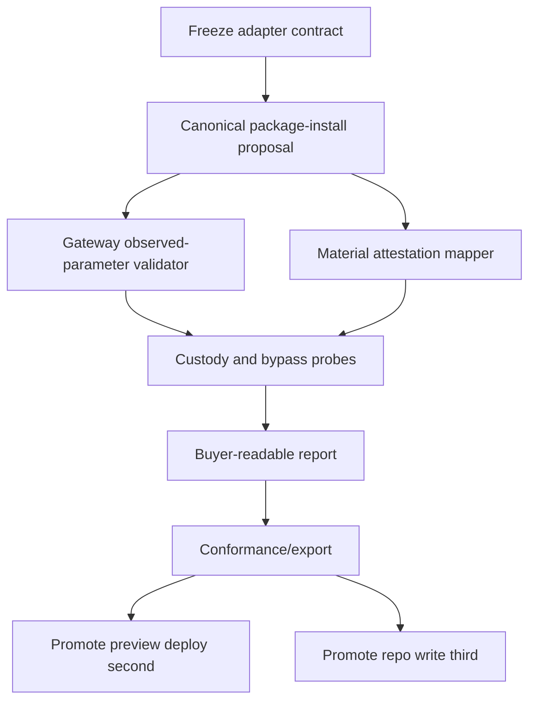

# GSD Macro Plan: Concrete Adapter Pack Expansion

## Goal

Invariant at stake: adapter pack expansion must prove that protected actions for automated decision making generalize without turning x402, runtime ingress, CLI, MCP, or reports into shortcut authority.

Build the first concrete adapter pack expansion around package-manager material attestation for one exact package install attempt. The pack must show that Handshake can take an automated dependency action, reduce it to an exact protected action contract, require material evidence, enforce gateway-bound authority, and leave a reconstructable receipt with explicit proof gaps.

The first wedge is x402 exact per-call protected action. It is not the protocol center. The package-manager adapter pack must preserve the Tier 1 spine while proving that exact per-call authorization can apply to non-payment protected actions.

## Non-Goals

- No payment management.
- No hosted operation claim.
- No broad runtime, MCP, or CLI enforcement claim.
- No supply-chain safety claim.
- No npm audit replacement claim.
- No Bun provenance verification claim.
- No claim that provenance, signatures, lockfiles, or attestations prove package code is benign.
- No package install execution outside an exact gateway-bound greenlight.
- No expansion into preview deploy or repo write until the package-install conformance slice closes.
- No god registry that centralizes every family, compiler, policy, validator, mapper, and bypass probe behind ambient runtime ingress authority.

## Source Boundary

Canonical source boundaries for this macro plan:

- `ProtectedActionAdapterPackSchema` is the adapter contract boundary.
- Runtime ingress may select the relevant compiler for an action family.
- Runtime ingress must not authorize protected action execution.
- CLI and MCP may expose proposal, evidence, inventory, or read-only surfaces.
- CLI and MCP must not be described as enforcement points unless a gateway-bound mutation path actually enforces the exact greenlight.
- Gateway observed-parameter validation is the pre-consequence enforcement boundary.
- Receipt evidence mapping is post-decision and post-gateway evidence, not proof that downstream business outcome succeeded.

The expansion order is:

1. Package-manager material attestation / package-install adapter pack.
2. Preview deploy adapter pack.
3. Repo write adapter pack.

## Current State

Known source state:

- `ProtectedActionAdapterPackSchema` exists and includes:
  - pack id/version;
  - action family;
  - protected surface;
  - parameter schema ref;
  - endpoint evidence schema ref;
  - install compiler ref;
  - policy rule pack ref;
  - gateway observed parameter validator ref;
  - receipt evidence mapper ref;
  - bypass probe kinds;
  - hostile fixture refs.
- A generic install proposal exists.
- Package install runtime compiler and gateway tests exist.
- Preview deploy runtime and gateway lanes exist.
- Repo write runtime and gateway lanes exist.
- Runtime ingress has cross-family hardcoding risk and must not become a god registry.
- CLI and MCP are proposal/evidence/read-only surfaces.
- Bun lockfile evidence is available as local material/reconstruction evidence, not npm provenance verification.

External evidence boundary:

- npm provenance and signatures can verify source/build/publisher posture and registry/tarball integrity.
- `npm audit signatures` verifies registry signatures and provenance attestations after `npm install` with a supported npm CLI.
- Trusted publishing and provenance depend on external package account, repository, and workflow configuration.
- None of this proves benign package code.

## Target State

A concrete package-manager adapter pack exists as the first promoted expansion pack.

It proves:

- the manifest is the activation boundary;
- package install is represented as an exact protected action contract;
- runtime ingress selects the package-install compiler but does not authorize execution;
- policy evaluates exact package-manager material evidence requirements;
- gateway observed-parameter validation enforces the exact binding before mutation;
- receipt mapping records:
  - proposed action;
  - authority binding;
  - exact contract;
  - material evidence;
  - gateway check;
  - execution outcome;
  - proof gaps;
  - reconstruction material;
  - bypass posture.
- lifecycle scripts are blocked by default unless separately contracted.
- raw sibling bypass is detected or blocks expansion.
- hostile fixtures prove the pack fails closed under drift, laundering, and bypass attempts.

The buyer-readable product claim becomes:

Handshake gates automated dependency actions on exact material evidence, policy, and gateway-bound authority.

## Assumptions

- The existing `ProtectedActionAdapterPackSchema` is close enough to freeze as the pack activation boundary, with only narrow additions allowed for conformance.
- The generic install proposal can be canonicalized into a package-install action contract without inventing broad package-manager authority.
- Existing package install runtime compiler and gateway tests can be extended into conformance fixtures.
- npm provenance/signature evidence is optional or gap-recorded when unavailable, not silently treated as satisfied.
- Bun lockfile evidence is useful for reconstruction and drift detection, not provenance verification.
- Lifecycle scripts are consequential execution and require separate contracting.
- Raw package-manager invocation outside the gateway is a bypass condition, not an unsupported happy path.
- Preview deploy and repo write can wait until package-install conformance demonstrates the adapter pattern.

## Decisions

1. Promote package-manager material attestation/package-install first.
2. Treat preview deploy as second.
3. Treat repo write as third.
4. Keep x402 as the first exact per-call protected action wedge, not the protocol center.
5. Treat the adapter manifest as the activation boundary.
6. Use small typed registries per concern instead of one god registry.
7. Runtime ingress selects compilers only; it does not authorize.
8. Gateway observed-parameter validator enforces exact binding.
9. Receipt evidence mapper records evidence and proof gaps; it does not certify benign code.
10. Block lifecycle scripts by default unless separately contracted.
11. Treat raw sibling bypass as a stop condition for expansion.
12. Require hostile fixtures before declaring the adapter pack promotable.

## Phases

Phase 1: Freeze Adapter Contract

- Confirm `ProtectedActionAdapterPackSchema` expresses the activation boundary.
- Separate pack identity, action family, protected surface, compiler, policy, gateway validator, evidence mapper, bypass probes, and hostile fixtures.
- Prevent runtime ingress from becoming the authorization registry.
- Define conformance requirements for a promoted adapter pack.

Phase 2: Canonical Package Install Proposal

- Canonicalize the generic install proposal into a package-install protected action contract.
- Bind package name, version/range resolution, registry, package manager, lockfile posture, lifecycle script posture, material evidence requirements, and idempotency expectations.
- Preserve uncertainty markers when resolution or evidence cannot be proven before install.

Phase 3: Gateway Observed-Parameter Validator

- Implement package-install observed-parameter validation as the enforcement boundary.
- Reject drift between canonical contract and observed install parameters.
- Reject reusable greenlights.
- Reject lifecycle scripts unless separately contracted.
- Reject raw sibling bypass or mark expansion blocked when detection is not available.

Phase 4: Material Attestation Mapper

- Map npm provenance/signature evidence, registry/tarball integrity, lockfile material, package manager version, and proof gaps into receipt evidence.
- Keep npm evidence claims narrow.
- Treat Bun lockfile evidence as reconstruction material, not provenance verification.
- Record absent or unverifiable evidence as proof gaps.

Phase 5: Custody And Bypass Probes

- Add hostile fixtures for provenance laundering, lockfile drift, lifecycle script execution, registry substitution, tarball mismatch, raw sibling bypass, stale policy, and credential custody ambiguity.
- Expansion cannot pass if bypass posture is unobserved or advisory only.

Phase 6: Buyer-Readable Report

- Produce a report format with sections:
  - action;
  - authority;
  - exact contract;
  - evidence;
  - outcome;
  - proof gaps;
  - reconstruction.
- Ensure the report does not imply package safety, hosted operation, or broad supply-chain security.

Phase 7: Conformance And Export

- Define adapter pack conformance export for the package-install slice.
- Produce a minimal conformance fixture for one npm install attempt.
- Export receipts and reports that reconstruct the chain without relying on chat transcript or runtime trace.

## Task Graph

Critical path:

1. Freeze adapter contract.
2. Canonicalize one npm install attempt.
3. Enforce observed-parameter validation.
4. Map material evidence and proof gaps.
5. Pass hostile fixtures.
6. Export receipt/report.

## Risks And Mitigations

- Shortcut authority: Runtime ingress, CLI, MCP, or report surfaces may be mistaken for enforcement.
  - Mitigation: declare gateway observed-parameter validation as the only pre-consequence enforcement boundary.

- Provenance laundering: npm provenance may be presented as package safety.
  - Mitigation: receipt language must say provenance/signatures verify source/build/publisher posture and integrity, not benign code.

- Lifecycle script consequence: install scripts can execute code during dependency install.
  - Mitigation: lifecycle scripts default blocked unless separately contracted.

- Lockfile drift: observed install may differ from contract or prior material state.
  - Mitigation: gateway validator rejects drift or records proof gap before consequence where rejection is impossible.

- Raw sibling bypass: generated code may call package-manager tools outside the protected gateway.
  - Mitigation: bypass probe required; absence of detection blocks expansion.

- Runtime/MCP/CLI overclaim: proposal and evidence surfaces may be marketed as enforcement.
  - Mitigation: all docs and reports must separate proposal, policy, gateway check, and receipt.

- Credential custody ambiguity: package registry tokens, CI identities, or local credentials may perform mutation outside the contract.
  - Mitigation: adapter pack must name custody boundary and proof gaps.

- Report theatre: buyer-readable report may summarize rather than bind to exact contract and receipt.
  - Mitigation: report must reference exact contract id/hash and receipt evidence ids.

## Validation Gates

Gate 1: Adapter Contract Freeze

- `ProtectedActionAdapterPackSchema` acts as activation boundary.
- No cross-family god registry is introduced.
- Runtime ingress remains compiler selection only.

Gate 2: Package Install Contract

- One npm install attempt can be represented as an exact protected action contract.
- Contract includes material evidence expectations and lifecycle script posture.
- Contract does not imply permission.

Gate 3: Gateway Enforcement

- Gateway validator rejects observed parameter drift.
- Greenlight is one-use and exact.
- Lifecycle scripts are blocked unless separately contracted.

Gate 4: Evidence Mapping

- npm signatures/provenance are recorded only within their real evidentiary scope.
- Bun lockfile evidence is recorded as local reconstruction material only.
- Missing evidence becomes a proof gap.

Gate 5: Hostile Fixtures

- Fixtures cover provenance laundering, lockfile drift, lifecycle scripts, registry substitution, tarball mismatch, raw sibling bypass, stale policy, and credential custody ambiguity.
- Any advisory-only bypass posture fails the gate.

Gate 6: Report And Export

- Report distinguishes action, authority, exact contract, evidence, outcome, proof gaps, and reconstruction.
- Export reconstructs the chain without trusting the runtime transcript.

## Cut Lines

Cut immediately:

- Any broad supply-chain security claim.
- Any claim that npm provenance proves package safety.
- Any Bun provenance claim.
- Any payment-management framing.
- Any hosted-operation framing.
- Any MCP/CLI/runtime enforcement claim not backed by gateway enforcement.
- Any registry design that turns runtime ingress into authorization.
- Any report section that summarizes authority without exact contract binding.
- Any lifecycle-script allowance without a separate contract.

Defer:

- Preview deploy adapter pack.
- Repo write adapter pack.
- Cross-runtime enforcement claims.
- Hosted control plane packaging.
- Buyer dashboard polish.
- Broad adapter marketplace language.

## Rollback / Stop Conditions

Stop expansion if:

- Runtime ingress becomes the authority holder.
- A greenlight can authorize more than one install attempt.
- Gateway observed-parameter validation cannot reject drift.
- Lifecycle scripts can execute under package-install authority without separate contracting.
- Raw sibling package-manager invocation cannot be detected, isolated, or treated as a blocking bypass.
- Receipt cannot distinguish gateway check from downstream install result.
- npm provenance/signature evidence is represented as benign-code proof.
- The report cannot reconstruct exact contract, authority, evidence, outcome, and proof gaps.
- The implementation requires broad CLI/MCP/runtime enforcement claims to sound useful.

## Smallest Next Action

Define the package-install conformance fixture for one npm install attempt: exact contract fields, expected npm material evidence, lifecycle script default-block posture, gateway observed parameters, receipt evidence mapping, and hostile drift cases.
