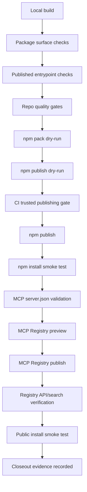

# EXECUTION: Public Distribution And Publication

## Invariant At Stake

Publication must distribute proposal/evidence/read surfaces only. It must not imply gateway enforcement, execution authority, or protected mutation control until those paths are actually enforced.

# Execution Plan: Public Distribution And Publication

## Phase 0: Local Source Readiness

Tasks:

1. Confirm package surface is intentional:
   ```bash
   npm run build
   node scripts/check-package-surface.mjs
   node scripts/check-published-entrypoints.mjs
   ```

2. Confirm repo quality gates:
   ```bash
   npm run format:check
   npm run check:repo
   ```

3. Confirm package metadata:
   - `package.json` has correct `name`, `version`, `description`, `license`, `repository`, `bin`, `files`, `exports`.
   - `bin` wrappers point only at built distributable files.
   - `dist/` contains every exported runtime entrypoint.
   - README package install docs match the actual package name and command shape.
   - No `.planning/` paths leak into repo-facing package docs or package metadata.

Dry-run gate:

```bash
npm pack --dry-run --json
```

Stop conditions:

- Unexpected files in packed tarball.
- Missing `dist` bundle or bin wrapper.
- Package docs claim enforcement, authority, gateway checks, or mutation protection beyond the implemented package.
- Any check script fails.

## Phase 1: NPM Publication Preflight

Tasks:

1. Confirm npm identity and registry:
   ```bash
   npm whoami
   npm config get registry
   npm view <package-name> version
   ```

2. Confirm version uniqueness:
   ```bash
   npm view <package-name>@<version> version
   ```

   Expected: not found for a new version.

3. Confirm 2FA/token posture:
   - Prefer npm trusted publishing with provenance from CI.
   - If using local publish, verify account 2FA is enabled and token scope is minimal.
   - Do not use broad long-lived automation tokens unless there is no CI alternative.

4. Run publish dry-run:
   ```bash
   npm publish --dry-run --access public
   ```

CI/release gate:

- Release must run from a clean git tag matching `package.json` version.
- CI must run build, package-surface checks, published-entrypoint checks, format, and repo check before publish.
- Trusted publishing/provenance should be required for the real publish job:
  ```bash
  npm publish --access public --provenance
  ```

Stop conditions:

- `npm whoami` is wrong.
- Registry is not `https://registry.npmjs.org/`.
- Version already exists.
- Provenance/trusted publishing is unavailable but release policy requires it.
- Dry-run tarball differs from expected package surface.

Rollback posture:

- npm versions are effectively immutable.
- If a bad version publishes, immediately deprecate it:
  ```bash
  npm deprecate <package-name>@<bad-version> "Do not use: publication error. Upgrade to <fixed-version>."
  ```
- Publish a corrected patch version. Do not attempt to pretend the bad artifact never existed.

## Phase 2: NPM Publish

Tasks:

1. Create and push release tag only after all local gates pass:
   ```bash
   git status --short
   git tag v<version>
   git push origin v<version>
   ```

2. Publish through CI trusted publishing, or locally only if explicitly accepted:
   ```bash
   npm publish --access public --provenance
   ```

3. Capture evidence:
   ```bash
   npm view <package-name>@<version> --json
   npm view <package-name>@<version> dist.integrity
   npm view <package-name>@<version> dist.tarball
   ```

Stop conditions:

- Dirty worktree before tag.
- CI quality gates fail.
- Publish succeeds but package metadata does not match intended version, tarball, or entrypoints.

## Phase 3: Post-NPM Smoke Tests

Tasks:

1. Install from npm in a clean temp project:
   ```bash
   mkdir -p /tmp/handshake-npm-smoke
   cd /tmp/handshake-npm-smoke
   npm init -y
   npm install <package-name>@<version>
   ```

2. Verify package import surface:
   ```bash
   node -e "import('<package-name>').then(m => console.log(Object.keys(m).sort()))"
   ```

3. Verify bin wrapper:
   ```bash
   npx <bin-name> --help
   ```

4. Verify published entrypoint assumptions:
   ```bash
   node -e "import('<package-name>/<exported-entrypoint>').then(() => console.log('ok'))"
   ```

Stop conditions:

- Installed package cannot import.
- Bin wrapper fails.
- Public entrypoints differ from README or check scripts.
- Help/docs imply authority enforcement where only read/proposal/evidence publication exists.

## Phase 4: MCP Registry Preflight

Tasks:

1. Validate `server.json` shape:
   - `mcpName` is stable and namespace-qualified.
   - Package reference points to the published npm package and exact version range policy.
   - Public install/preview commands match the npm package.
   - Description is distribution-scoped, not enforcement-scoped.
   - Registry metadata does not claim gateway authority unless the package actually performs gateway checks.

2. Validate with the official MCP Registry publisher/validator once pinned:
   ```bash
   mcp-publisher validate server.json
   ```

3. Preview rendered registry listing if supported:
   ```bash
   mcp-publisher preview server.json
   ```

Stop conditions:

- `server.json` package reference does not match the npm-published package.
- `mcpName`/namespace conflicts or is not owned.
- Public install command fails in a clean environment.
- Registry listing claims Handshake provides enforcement authority through publication alone.

## Phase 5: MCP Registry Publish

Tasks:

1. Authenticate with the registry using the intended namespace owner.
2. Publish the validated `server.json`:
   ```bash
   mcp-publisher publish server.json
   ```

3. Capture registry publish evidence:
   ```bash
   curl -s <mcp-registry-server-api-url-for-mcpName>
   ```

Stop conditions:

- Namespace ownership is not verified.
- Registry publish points at unpublished or wrong npm version.
- Registry generated install command does not work.
- Registry listing cannot be reconstructed from `server.json`.

Rollback posture:

- If registry metadata is wrong, publish a corrected registry update if the registry supports replacement.
- If package artifact is wrong, deprecate npm version and update registry to point at the corrected patch.
- If namespace is wrong, halt. Do not create a second public identity without an explicit naming decision.

## Phase 6: Post-Registry Smoke Tests

Tasks:

1. Search registry by name:
   ```bash
   curl -s "<mcp-registry-search-url>?q=<mcpName>"
   ```

2. Fetch registry server record:
   ```bash
   curl -s "<mcp-registry-server-url>/<mcpName>"
   ```

3. Install exactly as public users would:
   ```bash
   <registry-provided-install-command>
   ```

4. Verify MCP server startup/read surfaces:
   ```bash
   <registry-provided-run-command> --help
   ```

5. Confirm registry metadata agrees with npm:
   - package name
   - version/range
   - bin command
   - README link
   - source repo
   - license
   - description

Stop conditions:

- Registry search cannot find the server after propagation window.
- Registry API returns stale or mismatched metadata.
- Public install command fails.
- MCP startup path differs from package docs.

## Docs And Claim Guards Needed Later

Likely updates when implementing:

- README: add install, CLI/bin, MCP install, and smoke-test examples.
- `docs/internal/decisions.md`: record that publication distributes proposal/evidence/read surfaces, not authority.
- `docs/internal/protocol-notes.md`: clarify published package boundary versus gateway enforcement boundary.
- Claim guard: reject README/docs language that says publication "enforces," "authorizes," "secures mutations," or "approves actions" unless tied to implemented gateway checks.
- Package guard: ensure `.planning/`, internal-only reports, local scratch files, and unpublished source paths cannot enter npm tarball.
- Entry-point guard: ensure README-documented imports and bin commands are present in built `dist`.

## Task Dependency Graph



## Closeout Commands

```bash
npm view <package-name>@<version> --json
npm install <package-name>@<version>
npx <bin-name> --help
curl -s "<mcp-registry-search-url>?q=<mcpName>"
curl -s "<mcp-registry-server-url>/<mcpName>"
npm run check:repo
```

Brutal verdict: keep the publication plan narrow. npm and MCP Registry make Handshake installable and inspectable; they do not create authority. Any copy, registry metadata, or release note that implies gateway enforcement from publication alone is advisory theatre.

Smallest next mechanism to build: a single release preflight script that runs build, package-surface checks, published-entrypoint checks, `npm pack --dry-run --json`, and fails on forbidden authority claims in package-facing docs.
