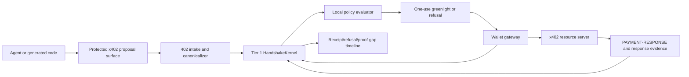

# Tier 2 X402 System Design

Status: architecture design scratch, created 2026-05-19.

## Invariant at stake

The agent may discover, propose, and explain a paid request. The agent must not
hold or exercise wallet signing authority. Only the wallet gateway can turn one
exact, policy-evaluated x402 payment contract into one signed payment payload.

## System purpose

Tier 2 is the self-hosted protected action loop on top of the Tier 1 protocol
kernel.

For the x402 example:

```text
principal intent:
  "Fetch the paid market data."

generated agent behavior:
  request paid URL, receive 402, propose payment

protected action:
  authorize one exact x402 payment attempt

gateway authority holder:
  wallet gateway owns signer

mutation:
  create PAYMENT-SIGNATURE and retry the paid request
```

## Architecture



## Components

### 1. Protected x402 proposal surface

Possible product surfaces:

- `handshake x402 fetch`;
- `protectedX402Fetch`;
- MCP tool `propose_x402_payment`;
- runtime wrapper for generated programs.

Boundary:

- may perform the initial request without payment;
- may capture status, URL, request hash, and `PAYMENT-REQUIRED`;
- may decode and canonicalize payment requirements;
- may create runtime evidence and a candidate action;
- must not hold a signer;
- must not send `PAYMENT-SIGNATURE`.

Failure if wrong:

> The generated code escaped the contract boundary.

### 2. 402 intake and canonicalizer

The intake layer converts x402 server terms into deterministic Handshake input.

Canonical fields:

- x402 version;
- header names observed;
- original request method, URL, headers digest, body digest;
- `PAYMENT-REQUIRED` raw header digest;
- decoded payment requirements digest;
- selected accepted payment detail digest;
- scheme, network, asset, amount, payTo, resource, facilitator;
- offer/receipt extension declarations;
- payment-identifier support and requirement posture;
- valid-until or timeout posture;
- seller identity evidence when available.

Boundary:

- seller offer evidence, not buyer authority;
- deterministic contract input, not permission;
- no policy interpretation at signing time.

### 3. Tier 1 kernel projection

Tier 2 should use existing protocol objects before adding a new protocol area.

Mapping:

- `ToolCapability`: `protected_x402_fetch`, raw x402 wrapper posture, wallet key
  reachability posture.
- `ActionType`: `x402_payment.exact`.
- `GatewayRegistryEntry`: local wallet gateway, policy version, custody mode,
  accepted action type, enforcement mode.
- `OperatingEnvelope`: allowed agent/runtime/resource/network/asset/gateway and
  attempt bounds.
- `RuntimeExecution`: generated program/request evidence.
- `GeneratedExecutionGraph`: request, 402 capture, candidate proposal, no signer
  node coverage.
- `IntentCompilationRecord`: vague intent plus selected paid request candidate.
- `CandidateAction`: proposed x402 protected spend.
- `ActionContract`: exact `X402PaymentContract`.
- `PolicyDecision`: greenlight/refusal/review/halt/quarantine.
- `Greenlight`: one exact contract, one gateway, one use.
- `GatewayCheckAttempt`: wallet gateway verification before signing.
- `MutationAttempt`: signed payment payload and retry attempt evidence.
- `Receipt`, `Refusal`, `ProofGap`, `IsolationState`: reconstruction and future
  authority reduction.

### 4. Local policy evaluator

Minimum policy checks:

- amount atomic value and display value;
- scheme `exact` for first build;
- network allowlist;
- asset/token allowlist;
- payTo allowlist or explicit unknown-payee refusal/proof posture;
- request method and URL/host/path allowlist;
- resource URL binding;
- facilitator allowlist or proof-gap posture;
- x402 version and header set;
- payment identifier required/optional/unsupported posture;
- offer signature required/optional/unsupported posture;
- expiry/timeout;
- agent identity and runtime identity;
- operating envelope and budget window;
- protected path posture;
- isolation state.

Decision outputs:

- greenlight one exact signing attempt;
- refusal with boundary and recovery path;
- review required with exact contract digest;
- halt/quarantine for raw signer exposure or sibling bypass;
- proof gap only for missing downstream evidence, never for authorization.

### 5. Wallet gateway

The wallet gateway is the enforcement point.

It must:

- hold signer material or call a managed signer that the agent cannot reach;
- load the exact `ActionContract`;
- load the exact `Greenlight`;
- verify greenlight is unexpired, unconsumed, `maxUses: 1`, right gateway, right
  protected surface, right action type, right contract digest, and right params
  digest;
- verify current isolation and protected path posture;
- construct or approve exactly one `PaymentPayload`;
- create `PAYMENT-SIGNATURE`;
- consume the greenlight atomically with gateway-check evidence;
- retry the original request with payment header;
- record downstream response, settlement evidence, and proof gaps.

It must refuse:

- missing greenlight;
- wrong contract digest;
- wrong gateway;
- wrong protected surface;
- expired greenlight;
- reused greenlight;
- changed `PAYMENT-REQUIRED`;
- raw signer detected in agent runtime;
- active isolation state.

### 6. Receipt timeline

The first Tier 2 receipt should be readable in a terminal and serializable as
structured evidence.

It must show:

- principal intent ref;
- agent/runtime;
- original request;
- `PAYMENT-REQUIRED` capture;
- contract digest and non-secret summary;
- policy decision;
- greenlight or refusal;
- wallet gateway check;
- payment signature digest, not raw secret-bearing payload where inappropriate;
- retry request digest;
- `PAYMENT-RESPONSE` capture;
- facilitator verify/settle result where visible;
- signed offer/receipt evidence where present;
- resource response status;
- proof gaps;
- bypass posture.

## Contract sketch

Represent this first as `ActionContract.parameters` for
`actionType: x402_payment.exact`. Do not add a new protocol core primitive until
the adapter proves that generic `ActionContract` is insufficient.

```yaml
contractType: x402_payment
x402Version: 2
scheme: exact
principalIntentRef: intent_...
agentIdentity: agent_...
runtimeIdentity: runtime_...
request:
  method: GET
  url: https://seller.example/api/data
  headersDigest: sha256:...
  bodyDigest: null
paymentRequired:
  rawHeaderDigest: sha256:...
  decodedDigest: sha256:...
  selectedAcceptDigest: sha256:...
  network: eip155:84532
  asset: usdc
  maxAmountRequired: "1000"
  payTo: "0x..."
  resource: https://seller.example/api/data
  facilitatorUrl: https://...
  timeoutSeconds: 60
extensions:
  paymentIdentifier:
    posture: required
    id: pay_...
  offerReceipt:
    offerSignatureDigest: sha256:...
    receiptExpected: preferred
policyInputs:
  policyPackRef: policy_x402_exact_v1
  budgetWindowRef: budget_...
gatewayBinding:
  gatewayId: gateway_wallet_local_...
  walletKeyRef: wallet_ref_...
  signerReachability: gateway_only
idempotency:
  logicalPaymentAttempt: payment_attempt_...
  retryScopeDigest: sha256:...
evidenceExpectations:
  requirePaymentResponse: true
  requireSettlementResponse: true
  signedReceipt: preferred
```

## State flows

### Happy path

```text
agent calls protected x402 fetch
-> server returns 402 + PAYMENT-REQUIRED
-> canonicalizer emits CandidateAction
-> kernel records ActionContract
-> policy greenlights exact contract once
-> wallet gateway verifies greenlight and posture
-> wallet signs one PaymentPayload
-> request retries with PAYMENT-SIGNATURE
-> server returns resource + PAYMENT-RESPONSE
-> receipt records controlled, observed, and missing evidence
```

### Policy refusal

```text
agent proposes paid request
-> contract amount/network/payTo/resource violates policy
-> policy records Refusal
-> wallet gateway is never invoked
-> receipt timeline shows wallet did not sign
```

### Gateway refusal

```text
greenlight exists
-> gateway observes changed payment requirements, wrong digest, replay, wrong
   gateway, wrong protected surface, expired greenlight, or active isolation
-> gateway records Refusal
-> wallet does not sign
```

### Proof gap

```text
gateway signs after valid check
-> retry or settlement result is unavailable, ambiguous, expired, unsupported,
   or contradictory
-> ProofGap records what is missing
-> receipt must not imply final payment success or resource correctness
```

### Bypass posture

```text
agent environment exposes EVM_PRIVATE_KEY or raw x402 wrapper
-> protected path posture is unsafe
-> policy halts or gateway refuses
-> receipt says installed path blocked because raw sibling authority was visible
```

## System design decisions

### Decision 1: Start gateway-first, not wrapper-first

The first build should be a wallet gateway plus proposal surface. A modified
`wrapFetchWithPayment` that still lives in the agent process is the wrong center
of gravity because it normalizes signer-adjacent generated code.

### Decision 2: Start with `exact`

`exact` has a known payment amount before the response. `upto` is deferred until
the system can prove final amount evidence, usage binding, and retry behavior.

### Decision 3: Handshake is not an x402 facilitator

Facilitator verify/settle results are evidence. They are not policy decisions,
greenlights, or gateway checks.

### Decision 4: Payment identifier is required for real-money proof

If a seller does not advertise payment-identifier support, the first real-money
Tier 2 example should refuse or record degraded retry posture. Fixture mode can
allow missing identifiers only to prove proof gaps.

### Decision 5: `.planning` design should not become Tier 1 canon

This packet informs implementation. Durable claims move into compact internal
docs only after source and conformance prove them.

## Non-claims

Tier 2 x402 is not:

- wallet custody infrastructure;
- a payment rail;
- an x402 facilitator;
- seller middleware;
- tax/accounting/procurement;
- marketplace infrastructure;
- fraud detection;
- hosted spend management;
- proof of resource correctness;
- proof of settlement finality beyond observed evidence;
- protection for raw sibling tools, shell paths, browser wallets, or leaked
  signer credentials outside the installed protected path.

## Feasibility verdict

Feasible if the signer is genuinely outside the agent runtime and the wallet
gateway is the only component capable of creating `PAYMENT-SIGNATURE`.

Not feasible if the first demo gives generated code `EVM_PRIVATE_KEY`,
`SVM_PRIVATE_KEY`, a managed wallet API token, or a wrapped x402 client that can
sign without Handshake.

## Smallest next mechanism

Build a local fixture that proves:

```text
no greenlight -> no PAYMENT-SIGNATURE
wrong digest -> no PAYMENT-SIGNATURE
valid one-use greenlight -> one PAYMENT-SIGNATURE
replay -> no second PAYMENT-SIGNATURE
```
