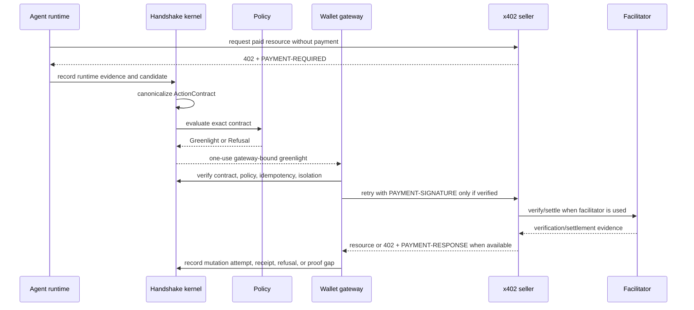

# X402 Architecture

Status: planning scratch, revised 2026-05-19.

## Invariant at stake

The x402 transaction is valid Tier 2 only if the wallet gateway is the first
component that can create `PAYMENT-SIGNATURE`. If generated code can sign, the
architecture is advisory, not Handshake.

## Role model

```text
principal
  owns intent and operating envelope

agent runtime
  generates execution evidence and proposes payment candidate

policy owner
  defines versioned local policy in Tier 2
  defines hosted policy in Tier 3

wallet gateway owner
  owns or controls signing authority

x402 seller
  returns PAYMENT-REQUIRED and fulfills resource if payment is accepted

facilitator
  verifies/settles x402 payment for the seller when used
```

Authority stays with the principal's policy and wallet gateway. The seller and
facilitator provide payment-protocol evidence, not principal authority.

## Kernel mapping

| Kernel object | X402 mapping | Tier 3/4 continuity |
| --- | --- | --- |
| `ToolCapability` | generated request capability and raw x402/wallet reachability posture | hosted install inventory; provider runtime claims |
| `ActionType` | `x402_payment.exact` | stable action family for policy and provider profiles |
| `GatewayRegistryEntry` | customer-owned wallet gateway, custody mode, policy version | hosted gateway enrollment; provider gateway registration |
| `OperatingEnvelope` | agent, runtime, allowed resource, network, asset, gateway, budget bounds | hosted policy pack and org rollout |
| `RuntimeExecution` | generated request attempt and 402 discovery evidence | retained execution evidence |
| `GeneratedExecutionGraph` | graph node showing paid request proposal, no signer node | hosted replay and review |
| `IntentCompilationRecord` | conversion of vague intent into candidate payment | compiler quality and refusal analytics |
| `CandidateAction` | proposed exact x402 payment | candidate review and policy evaluation |
| `ActionContract` | canonical x402 V2 payment contract | stable evidence object across tiers |
| `PolicyDecision` | deterministic local/hosted decision | hosted policy distribution |
| `Greenlight` | one-use wallet-gateway-bound pass | provider-verifiable authority token |
| `GatewayCheckAttempt` | pre-signature wallet verification | provider/customer enforcement evidence |
| `MutationAttempt` | payment signature creation and paid retry | downstream operation reconciliation |
| `Receipt` | reconstructed chain and x402 evidence | retention, search, audit |
| `Refusal` | no authority/no signature evidence | policy tuning and recovery |
| `ProofGap` | missing settlement/receipt/finality/idempotency evidence | recovery and audit queue |
| `IsolationState` | future block after signer exposure or divergence | org-level containment |

## Contract shape

The first implementation should use generic `ActionContract.parameters`, not a
new protocol primitive.

```yaml
actionType: x402_payment.exact
x402Version: 2
request:
  method: GET
  url: https://seller.example/data
  headersDigest: sha256:...
  bodyDigest: null
paymentRequired:
  rawHeaderDigest: sha256:...
  decodedDigest: sha256:...
  selectedPaymentDetailsDigest: sha256:...
  scheme: exact
  network: eip155:84532
  asset: usdc
  maxAmountRequired: "1000"
  payTo: "0x..."
  resource: https://seller.example/data
  facilitatorUrl: https://...
  timeoutSeconds: 60
extensions:
  paymentIdentifier:
    required: true
    valueDigest: sha256:...
  signedOffer:
    posture: optional_evidence
    offerDigest: sha256:...
gateway:
  gatewayId: gateway_wallet_local_...
  policyVersion: x402-policy-v1
  custodyMode: customer_owned
  authorityHolder: wallet_gateway
idempotency:
  key: x402-attempt-...
  retryScopeDigest: sha256:...
evidence:
  requirePaymentResponse: true
  requireSettlementEvidence: true
  signedReceipt: optional_evidence
```

Important: `maxAmountRequired` is x402 terminology. In the `exact` scheme, the
contract still represents one fixed payment requirement selected before signing.

## Authority sequence



## Tier 2 requirements

Tier 2 is acceptable only when it proves:

- generated code cannot access the signer in the protected path;
- candidate payment is exact and canonicalized;
- policy can refuse before authority exists;
- greenlight is one-use, gateway-bound, and consumed;
- wallet gateway signs only after the exact check;
- replay, mismatch, drift, and isolation refuse before signature;
- receipt distinguishes gateway check from x402 settlement/resource evidence;
- raw sibling authority is reported as unsafe posture, not silently ignored.

## Tier 3 migration requirements

The Tier 2 architecture must leave these migration seams intact:

- policy pack can move from local file to hosted versioned distribution;
- receipt file can move to hosted retention without changing meaning;
- gateway registration can move to hosted enrollment without moving signing
  authority into the agent;
- refusal/proof-gap records can move into hosted audit and recovery queues;
- install posture can become org-level health without claiming universal
  enforcement.

Tier 3 adds operation around the same chain. It must not create a hosted bypass
around the gateway.

## Tier 4 migration requirements

The Tier 4 path is provider-native or provider-certified enforcement.

For x402 this could mean:

- wallet provider implements the Handshake-compatible gateway check before
  signing;
- x402 client provider offers a mode where payment signing calls require a
  verified Handshake greenlight;
- payment infrastructure provider emits attestable evidence for settlement and
  signed receipt support;
- agent runtime provider blocks raw signer access and exposes generated
  execution evidence suitable for Handshake.

Tier 4 is reached only when the provider or customer gateway can block mutation.
If it only logs after signing, it is not Tier 4.

## Architecture decisions

### Decision 1: x402 is a proof lens, not the product category

Keep x402 because the signature boundary is concrete. Do not turn Tier 2 into a
payment product.

### Decision 2: buyer-side first

The first proof is buyer-side because the authority question is principal spend.
Seller middleware and facilitator behavior are downstream evidence.

### Decision 3: exact scheme first

Start with x402 V2 `exact`. Treat `upto` as a future hostile fixture because the
seller can determine actual usage after signature.

### Decision 4: policy before operation, operation before ecosystem

Tier 2 proves local policy and gateway enforcement. Tier 3 operates it across
orgs. Tier 4 moves enforcement into provider/customer boundaries.

## Smallest next mechanism

Build a fake-signing wallet gateway fixture whose records are shaped exactly as
Tier 3 hosted retention and Tier 4 provider attestation would need them.
