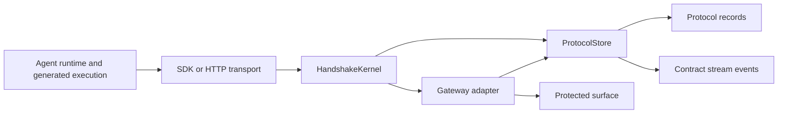
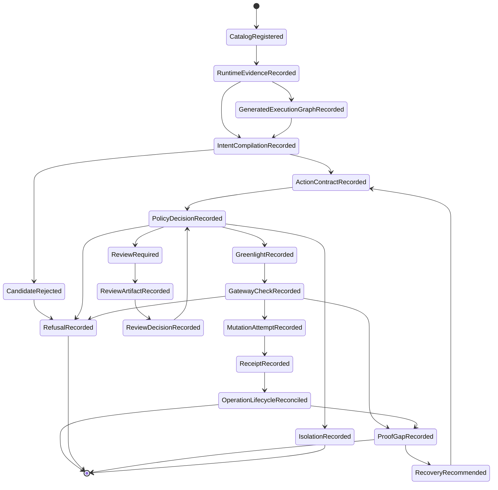

# Protocol Kernel Architecture And Schema

Last protocol architecture audit: 2026-05-19.

This document is the canonical architecture and schema map for the Handshake
protocol kernel. It expands `docs/internal/protocol-definition.md` without
changing the authority rule.

## Architecture Summary

Handshake is a TypeScript protocol kernel, not a full hosted product.

The kernel receives recorded execution evidence and exact transition inputs,
validates them against protocol schemas, writes append-only records and stream
events, and exposes enough state for gateways, HTTP transport, SDK clients,
runtime proposal helpers, storage adapters, and conformance checks to preserve
the authority boundary.

The gateway, not the runtime, is the enforcement point. The store is durable
reconstruction truth. Runtime evidence and review artifacts are inputs, not
authority.

## Source Ownership

| Path                      | Owns                                                                                      |
| ------------------------- | ----------------------------------------------------------------------------------------- |
| `src/protocol/kernel.ts`  | Transition facade over protocol areas.                                                    |
| `src/protocol/public`     | Public schema and input aggregation.                                                      |
| `src/protocol/foundation` | Canonicalization, IDs, reason codes, errors, base schemas, transition guards.             |
| `src/protocol/events`     | Stream event schemas, digest chains, and record commit helpers.                           |
| `src/protocol/context`    | Transition request context records.                                                       |
| `src/protocol/navigation` | Transition metadata, phase, records written, authority boundary, and evidence obligation. |
| `src/protocol/store`      | Store port and atomic commit contracts.                                                   |
| `src/protocol/areas`      | Owned protocol primitives and state transitions.                                          |
| `src/http`                | Hono/Worker transport and route dispatch.                                                 |
| `src/runtime`             | Runtime proposal helpers and generated-execution adapters.                                |
| `src/adapters`            | Reference gateway fixtures that mutate only after verified gateway checks.                |
| `src/conformance`         | Reference conformance probes, not standards certification.                                |
| `src/storage`             | D1, memory, KV, and store plumbing.                                                       |
| `src/sdk`                 | Typed HTTP client ergonomics.                                                             |

## Kernel Transition Surface

`HandshakeKernel` exposes the transition methods that define the protocol
surface:

| Method                                    | Phase                     | Authority boundary                                                                                    |
| ----------------------------------------- | ------------------------- | ----------------------------------------------------------------------------------------------------- |
| `putCatalogObject`                        | catalog                   | Registers immutable catalog/envelope records; catalog presence is not authorization.                  |
| `createRuntimeExecution`                  | runtime evidence          | Records execution-block shape without authority.                                                      |
| `createGeneratedExecutionGraph`           | generated execution graph | Records generated-code/spec graph evidence and coverage posture.                                      |
| `createProtectedPathPosture`              | protected path posture    | Records current installation, bypass, and drift posture.                                              |
| `compileIntent`                           | intent compilation        | Emits a candidate action or compiler refusal.                                                         |
| `proposeActionContract`                   | action contract           | Canonicalizes a contractable candidate into exact proposed commitment.                                |
| `evaluatePolicy`                          | policy                    | Records greenlight, refusal, review requirement, halt, or quarantine.                                 |
| `createReviewArtifact`                    | review                    | Records a rendered review artifact bound to exact digests.                                            |
| `createReviewDecision`                    | review                    | Records a reviewer decision bound to the artifact and contract.                                       |
| `gatewayCheck`                            | gateway                   | Verifies exact greenlight before mutation and records gate, mutation, receipt, refusal, or proof gap. |
| `reconcileSurfaceOperation`               | operation lifecycle       | Observes downstream finality without authorizing retry mutation.                                      |
| `createIsolationState`                    | isolation                 | Records future authority reduction.                                                                   |
| `createBreakerDecision`                   | isolation                 | Applies breaker decisions to future policy/gateway checks.                                            |
| `createReceiptExport`                     | receipt export            | Packages existing evidence only.                                                                      |
| `createRecoveryRecommendation`            | recovery                  | Recommends follow-up after receipt/refusal/proof gap.                                                 |
| `transitionRecoveryRecommendationStatus`  | recovery                  | Records recovery lifecycle state without creating mutation authority.                                 |
| `resolveRecoveryTerminalConflictProofGap` | recovery                  | Records proof gap when recovery terminal state conflicts.                                             |

## Protocol Record Taxonomy

Every durable object is stored as a `ProtocolRecord` discriminated by
`objectType`.

| Object type                                 | Schema owner                | Role                                                                       |
| ------------------------------------------- | --------------------------- | -------------------------------------------------------------------------- |
| `tool_capability`                           | `catalog-envelope`          | Callable runtime capability and bypass posture.                            |
| `action_type`                               | `catalog-envelope`          | Declared consequential action type.                                        |
| `gateway_registry_entry`                    | `catalog-envelope`          | Gateway adapter, policy version, credential custody, and enforcement mode. |
| `operating_envelope`                        | `catalog-envelope`          | Attempt bounds for principal, agent, resources, gateways, and policy pack. |
| `transition_request_context`                | `context`                   | Caller and request context evidence.                                       |
| `runtime_execution`                         | `runtime-evidence`          | Runtime execution-block evidence.                                          |
| `generated_execution_graph`                 | `generated-execution-graph` | Generated-code/spec evidence and coverage posture.                         |
| `protected_path_posture`                    | `protected-path-posture`    | Installed, bypass, drift, or unknown posture for a protected path.         |
| `intent_compilation`                        | `intent-compilation`        | Candidate action, assumptions, uncertainty, and compiler refusal posture.  |
| `action_contract`                           | `action-contract`           | Exact proposed protected action.                                           |
| `policy_decision`                           | `policy-greenlight`         | Decision against one exact contract.                                       |
| `greenlight`                                | `policy-greenlight`         | One-use gateway-bound pass.                                                |
| `review_artifact`                           | `review-binding`            | Rendered review artifact bound to exact digests.                           |
| `review_decision`                           | `review-binding`            | Reviewer decision bound to artifact and contract.                          |
| `breaker_decision`                          | `isolation-breaker`         | Control decision that changes future authority posture.                    |
| `isolation_state`                           | `isolation-breaker`         | Persistent block or reduction for future policy/gateway checks.            |
| `gateway_check_attempt`                     | `gateway-gate`              | Pre-mutation gateway verification result.                                  |
| `mutation_attempt`                          | `gateway-gate`              | Protected mutation attempt evidence.                                       |
| `protected_surface_operation_claim`         | `operation-lifecycle`       | Claim over downstream protected-surface operation state.                   |
| `surface_operation_reconciliation`          | `operation-lifecycle`       | Downstream finality observation.                                           |
| `proof_gap`                                 | `proof-gap`                 | Missing, ambiguous, expired, unavailable, or contradictory evidence.       |
| `receipt`                                   | `receipt-export`            | Reconstructable action chain evidence.                                     |
| `receipt_export`                            | `receipt-export`            | Export package of existing receipt evidence.                               |
| `recovery_recommendation`                   | `recovery`                  | Follow-up recommendation after refusal, gap, or ambiguous outcome.         |
| `recovery_recommendation_status_transition` | `recovery`                  | Recovery lifecycle state change.                                           |
| `contract_stream_event`                     | `events`                    | Ordered event evidence for reconstruction.                                 |

## Schema Backbone

The protocol schemas are strict Zod objects. The core schema groups are:

### Catalog And Envelope

- `ToolCapability`: runtime adapter, tool namespace/name, capability class,
  read/write classification, wrapper status, raw bypass posture, input/output
  schema refs, secret-bearing fields.
- `ActionType`: action class, protected surface kind, required fields,
  canonical parameter schema, resource schema, evidence requirements, default
  receipt requirement, idempotency requirement.
- `GatewayRegistryEntry`: gateway adapter, gate endpoint, gateway policy
  contract/version, drift mode, accepted action catalog versions, receipt and
  isolation capabilities, credential custody, enforcement mode, authority
  holder.
- `OperatingEnvelope`: principal, agent, objective, allowed action classes,
  gateways, resources, required protected path state, policy pack/version,
  issue/expiry/revocation.

Catalogs define what can be proposed. They do not authorize mutation.

### Runtime And Compilation

- `RuntimeExecution` records runtime execution shape.
- `GeneratedExecutionGraph` records generated-code/spec graph evidence and
  coverage posture.
- `IntentCompilationRecord` ties principal intent, agent, runtime adapter,
  envelope, catalogs, gateway registry, assumptions, uncertainty markers,
  required evidence, compiler version, and one `CandidateAction`.
- `CandidateAction` includes catalog refs, gateway refs, action class, resource,
  sequence number, required prior contracts, params digest, non-secret summary,
  secret refs, expected side effects, bounds, idempotency key, expiry, generated
  execution refs, and candidate digest.

The compiler may produce a contractable candidate or a rejected candidate. It
does not produce authority.

### Action Contract

`ActionContract` binds:

- intent compilation and candidate IDs;
- candidate digest;
- envelope and operating envelope digest;
- principal, agent, run, runtime adapter;
- sequence and prior contract dependencies;
- recovery linkage when applicable;
- gateway registry entry, gateway ID, gateway policy contract/version;
- credential custody and enforcement mode;
- mutation credential holder and gateway authority holder;
- tool capability and action type digests;
- action class, protected surface kind, resource ref;
- required protected path state;
- generated execution graph/node binding digests;
- parameters, params digest, non-secret summary, secret refs;
- purpose, expected side effects, evidence refs, bounds;
- idempotency key, rollback hint, canonicalizer version;
- contract digest and optional signature.

The contract is exact proposed commitment. It is not execution authority.

### Policy, Review, And Greenlight

- `PolicyDecision` binds one contract to a policy pack/version, evaluator
  version, policy input digest, decision, reason code, matched rules, required
  receipt level, isolation snapshot, expiry, and optional signature.
- `ReviewArtifactRecord` binds a rendered artifact to the exact contract digest,
  policy input digest, rendered uncertainty digest, artifact digest, and gateway
  policy version.
- `ReviewDecision` binds the reviewer, review artifact digest, contract digest,
  policy input digest, gateway policy version, decision, reason, expiry, and
  attestation.
- `Greenlight` binds one contract, one policy decision, one gateway registry
  entry/version, one gateway, one action class, one resource, required protected
  path state, params digest, contract digest, `maxUses: 1`, validity window,
  isolation snapshot, required receipt level, and consumption state.

Review may inform policy. Review is not authority by itself.

### Gateway, Mutation, Receipt

- `GatewayCheckAttempt` records gateway policy version, pinned/current drift
  status, contract ID, greenlight ID, contract digest seen, greenlight digest
  seen, params digest seen, idempotency key seen, isolation snapshot, protected
  path posture seen, gate decision, reason code, consumption status, and
  mutation attempt ref.
- `MutationAttempt` records gate attempt, contract, greenlight, gateway, action
  class, resource, idempotency key, outcome, reason code, downstream operation
  ref, start time, and finish time.
- `Receipt` records contract, policy decision, greenlight, gate attempt,
  mutation attempt, gateway, policy decision status, gateway check status,
  greenlight consumption status, mutation attempt status, downstream execution
  status, proof gaps, evidence refs, stream refs, receipt digest, audit chain
  digest, finality status, and emission time.

The gateway check is the enforcement point. The receipt is reconstruction
evidence, not business success.

### Refusal, Proof Gap, Isolation, Recovery

- `Refusal` records phase, relevant object refs, reason code, reason, evidence
  refs, refusal time, and hard flags that authority was not created and mutation
  was not attempted.
- `ProofGap` records missing, ambiguous, expired, unavailable, or contradictory
  evidence tied to the affected objects.
- `IsolationState` records a future policy/gateway block or authority
  reduction.
- `RecoveryRecommendation` records follow-up after refusal, gap, or ambiguous
  downstream state. Follow-up mutation requires a new action contract.

## Authority Sequence

## Store And Atomicity

`ProtocolStore` owns durable records, stream tails, stream events, current
protected path posture, protected-surface operation claims, receipt lookup by
mutation attempt, isolation state lookup, greenlight consumption, protocol
commits, and gateway-check commits.

Authority-bearing commits must preserve:

- immutable record identity by canonical digest;
- ordered stream events;
- one greenlight issuance per contract;
- one greenlight consumption per gateway attempt;
- protected-surface operation claim conflict detection;
- recovery terminal conflict detection;
- replay refusal when a greenlight is already consumed.

Consistency beats availability for authority-bearing transitions.

## Gateway Policy Lifecycle

Gateway policy is set before action time by the protected-surface authority
holder.

1. A gateway is installed or registered.
2. Its `GatewayRegistryEntry` declares gateway policy contract/version,
   accepted action catalog versions, drift mode, credential custody, enforcement
   mode, authority holder, receipt capability, and isolation capability.
3. An `ActionContract` pins the gateway policy version.
4. A `Greenlight` carries the gateway policy version and exact contract binding.
5. At mutation time, `GatewayCheckAttempt` compares pinned policy, current
   policy, contract digest, params digest, protected path posture, idempotency
   key, and isolation snapshot.
6. Compatible stricter drift may proceed only if the gateway policy permits it.
   Incompatible or unknown drift refuses before mutation.

Self-hosted installs can set this as local versioned config. Hosted operation
can set this as hosted versioned policy distributed to gateways. In both cases,
enforcement remains at the gateway.

## Conflict And Deny Semantics

Conflicts narrow authority:

- catalog/envelope mismatch: compiler or proposal refusal;
- policy mismatch: policy refusal;
- review rejection or expiry: review refusal or policy refusal;
- active isolation: policy or gateway refusal;
- replayed greenlight: gateway replay refusal;
- params/resource/idempotency drift: gateway refusal;
- incompatible gateway policy drift: gateway refusal;
- operation claim conflict: refusal or proof gap;
- ambiguous downstream finality: proof gap;
- recovery terminal conflict: proof gap.

Deny events are durable evidence. They should be queryable by phase, reason
code, object refs, policy version, gateway version, authority-created flag, and
mutation-attempted flag.

## Extension Boundary

Self-hosted operation adds installable protected-action loops around this
kernel.

Hosted operation adds policy management, receipt retention, search, rollout,
audit, and recovery operations around this kernel.

Bilateral ecosystem operation may add negotiation and linked agreements, but
each party's obligation must still become its own normal `ActionContract`,
policy decision, greenlight, gateway check, and receipt/refusal/proof-gap chain.

Linked agreements can coordinate obligations. They cannot create shared ambient
permission.
