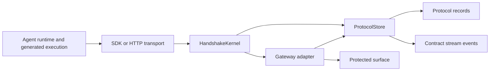
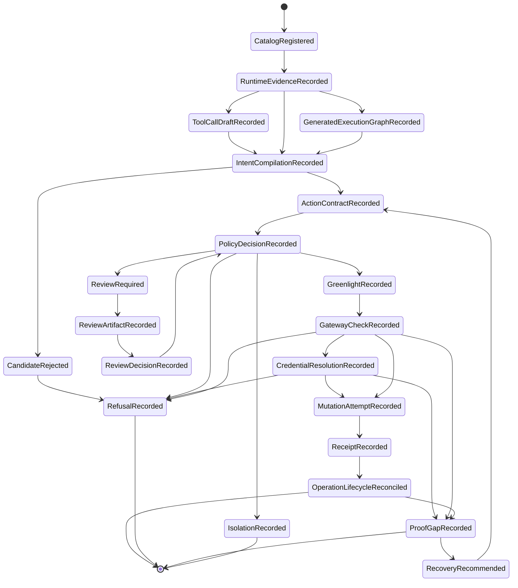

# Protocol Kernel Architecture And Schema

Last protocol architecture audit: 2026-05-21.

This document is the canonical architecture and schema map for the Handshake
protocol kernel. It expands `docs/internal/protocol-definition.md` without
changing the authority rule.

## Architecture Summary

Handshake is a TypeScript protocol kernel, not a full hosted product.

The kernel receives recorded execution evidence and exact transition inputs,
validates them against protocol schemas, writes append-only records and stream
events, and exposes enough state for gateways, HTTP transport, SDK clients,
runtime proposal helpers, storage adapters, and conformance checks to preserve
the authority boundary.

The gateway, not the runtime, is the enforcement point. The store is durable
reconstruction truth. Runtime evidence and review artifacts are inputs, not
authority.

Product language should describe the buyer-facing outcome as a cleared
protected-action event: one terminal Handshake event with reconstructable
evidence. Architecture language should keep the split strict: the protocol
kernel records authority-bearing transitions, while each product surface exposes
proposal/evidence/readback without creating authority. An AuthorityCertificate is
verifiable terminal evidence for one event. The certificate is terminal evidence, not permission, identity, settlement, hosted trust, or reusable auth.

## Local Establishment Boundary

The current foundation is locally established for source and test
purposes. It covers the protocol state machine, memory and D1 persistence,
reference gateways, `x402_payment.exact` as one proof profile, local x402 payment
D1/HTTP establishment, local hostile x402 bypass/custody probe records,
package-install supply-chain parameter binding, provider-neutral credential
custody records, idempotency recovery projection, non-authority representation
schemas, codemode/runtime generated-execution proposal paths, auth.md protected
API call provenance/custody evidence, and public runtime ingress surfaces for
local x402 payment and package-install dispatch boundaries.

It is not an external establishment claim. Live provider custody, hosted
operation, broad MCP/CLI/browser/shell/network runtime ingestion, independent
package-material attestation, aggregate payment-budget management, cross-org
AuthorityCertificate trust, remote JWKS trust fetching, live revocation
authority, and hosted mutation authority remain outside this kernel. Local
AuthorityCertificate minting, offline pinned-key verification, and non-mutating
hosted verifier projections over configured local trust material are part of the
source foundation. Current x402 spend enforcement is per-call only; aggregate
payment-budget management is intentionally outside the current remit, and local
spend-window fields are non-enforced metadata.

Local/source-owned surfaces are validated for the protocol kernel and product
surface boundary. Public npm `handshake-protocol-kernel@0.2.7`
availability is verified by trusted-publish workflow, registry readback, npm
signature metadata, provenance publication, and clean installed-artifact smoke;
public npm availability does not create authority. MCP Registry discoverability
remains a proof gap.

## Source Ownership

| Path                                | Owns                                                                                        |
| ----------------------------------- | ------------------------------------------------------------------------------------------- |
| `src/protocol/kernel.ts`            | Transition facade over protocol areas.                                                      |
| `src/protocol/public`               | Public schema and input aggregation.                                                        |
| `src/protocol/foundation`           | Canonicalization, IDs, reason codes, errors, base schemas, transition guards.               |
| `src/protocol/events`               | Stream event schemas, digest chains, and record commit helpers.                             |
| `src/protocol/context`              | Transition request context records.                                                         |
| `src/protocol/navigation`           | Transition metadata, phase, records written, authority boundary, and evidence obligation.   |
| `src/protocol/evidence-projections` | Redacted diagnostic projections derived from protocol records.                              |
| `src/protocol/store`                | Store port and atomic commit contracts.                                                     |
| `src/protocol/areas`                | Owned protocol primitives and state transitions.                                            |
| `src/http`                          | Hono/Worker transport and route dispatch.                                                   |
| `src/runtime`                       | Runtime ingress and proposal helpers; observer/compiler evidence, not authority.            |
| `src/adapters`                      | Reference gateway fixtures that mutate only after verified gateway checks.                  |
| `src/conformance`                   | Reference conformance probes, not standards certification.                                  |
| `src/storage`                       | D1, memory, KV, and store plumbing.                                                         |
| `src/sdk`                           | Typed HTTP client ergonomics.                                                               |
| `src/cli`                           | Local command manifest, APS evidence rendering, conformance status, and cert verification.  |
| `src/mcp`                           | Model-facing proposal/evidence schema and resource mapping; not authority or process start. |
| `src/surfaces`                      | Non-authority boundary manifests for SDK, CLI, MCP, and other product surfaces.             |

## Kernel Transition Surface

`HandshakeKernel` exposes the transition methods that define the protocol
surface:

| Method                                    | Phase                     | Authority boundary                                                                                    |
| ----------------------------------------- | ------------------------- | ----------------------------------------------------------------------------------------------------- |
| `putCatalogObject`                        | catalog                   | Registers immutable catalog/envelope records; catalog presence is not authorization.                  |
| `createRuntimeExecution`                  | runtime evidence          | Records execution-block shape without authority.                                                      |
| `createGeneratedExecutionGraph`           | generated execution graph | Records generated-code/spec graph evidence and coverage posture.                                      |
| `registerGatewayCredentialRef`            | credential custody        | Records opaque gateway-side credential custody evidence without secret material.                      |
| `recordGatewayCustodyProofPacket`         | credential custody        | Records redacted custody proof evidence; it does not approve, sign, or execute protected mutations.   |
| `recordCredentialResolutionEvidence`      | credential custody        | Records post-gate credential resolution/use evidence; it does not retrieve secrets or mint authority. |
| `createBypassProbe`                       | bypass probe              | Records protected-path bypass evidence without creating posture or authority.                         |
| `createToolCallDraft`                     | tool-call draft           | Records streamed/generated tool-call input state before candidate construction.                       |
| `createProtectedPathPosture`              | protected path posture    | Records probe-backed current installation, bypass, and drift posture.                                 |
| `compileIntent`                           | intent compilation        | Emits a candidate action or compiler refusal.                                                         |
| `proposeActionContract`                   | action contract           | Canonicalizes a contractable candidate into exact proposed commitment.                                |
| `createAuthorityCertificate`              | authority certificate     | Signs existing terminal evidence; creates no policy, greenlight, gateway check, or mutation proof.    |
| `evaluatePolicy`                          | policy                    | Records greenlight, refusal, review requirement, halt, or quarantine.                                 |
| `createReviewArtifact`                    | review                    | Records a rendered review artifact bound to exact digests.                                            |
| `createReviewDecision`                    | review                    | Records a reviewer decision bound to the artifact and contract.                                       |
| `gatewayCheck`                            | gateway                   | Verifies exact greenlight before mutation and records gate, mutation, receipt, refusal, or proof gap. |
| `reconcileSurfaceOperation`               | operation lifecycle       | Observes downstream finality without authorizing retry mutation.                                      |
| `createIsolationState`                    | isolation                 | Records future authority reduction.                                                                   |
| `createBreakerDecision`                   | isolation                 | Applies breaker decisions to future policy/gateway checks.                                            |
| `createReceiptExport`                     | receipt export            | Packages existing evidence only.                                                                      |
| `createRecoveryRecommendation`            | recovery                  | Recommends follow-up after receipt/refusal/proof gap.                                                 |
| `transitionRecoveryRecommendationStatus`  | recovery                  | Records recovery lifecycle state without creating mutation authority.                                 |
| `resolveRecoveryTerminalConflictProofGap` | recovery                  | Records proof gap when recovery terminal state conflicts.                                             |

## Protocol Record Taxonomy

Every durable object is stored as a `ProtocolRecord` discriminated by
`objectType`.

| Object type                                 | Schema owner                | Role                                                                                            |
| ------------------------------------------- | --------------------------- | ----------------------------------------------------------------------------------------------- |
| `tool_capability`                           | `catalog-envelope`          | Callable runtime capability and bypass posture.                                                 |
| `action_type`                               | `catalog-envelope`          | Declared consequential action type.                                                             |
| `gateway_registry_entry`                    | `catalog-envelope`          | Gateway adapter, policy version, credential custody, and enforcement mode.                      |
| `operating_envelope`                        | `catalog-envelope`          | Attempt bounds for principal, agent, resources, gateways, and policy pack.                      |
| `gateway_credential_ref`                    | `credential-custody`        | Opaque gateway-side credential ref bound into exact contracts.                                  |
| `gateway_custody_proof_packet`              | `credential-custody`        | Redacted packet tying credential ref, protected-path posture, probes, drift, and custody proof. |
| `credential_resolution_evidence`            | `credential-custody`        | Redacted post-gate credential resolution/use evidence.                                          |
| `transition_request_context`                | `context`                   | Caller and request context evidence.                                                            |
| `runtime_execution`                         | `runtime-evidence`          | Runtime execution-block evidence.                                                               |
| `generated_execution_graph`                 | `generated-execution-graph` | Generated-code/spec evidence and coverage posture.                                              |
| `bypass_probe`                              | `bypass-probe`              | Named bypass/custody/drift/failure-closed probe evidence.                                       |
| `tool_call_draft`                           | `tool-call-draft`           | Generated tool-call input state before candidate finalization.                                  |
| `protected_path_posture`                    | `protected-path-posture`    | Installed, bypass, drift, or unknown posture for a protected path.                              |
| `intent_compilation`                        | `intent-compilation`        | Candidate action, assumptions, uncertainty, and compiler refusal posture.                       |
| `action_contract`                           | `action-contract`           | Exact proposed protected action.                                                                |
| `authority_certificate`                     | `authority-certificate`     | Terminal signed evidence for receipt, refusal, proof gap, or replay.                            |
| `policy_decision`                           | `policy-greenlight`         | Decision against one exact contract.                                                            |
| `greenlight`                                | `policy-greenlight`         | One-use gateway-bound pass.                                                                     |
| `idempotency_ledger_entry`                  | `idempotency-ledger`        | Duplicate-authority ledger entry for one protected idempotency scope.                           |
| `review_artifact`                           | `review-binding`            | Rendered review artifact bound to exact digests.                                                |
| `review_decision`                           | `review-binding`            | Reviewer decision bound to artifact and contract.                                               |
| `breaker_decision`                          | `isolation-breaker`         | Control decision that changes future authority posture.                                         |
| `isolation_state`                           | `isolation-breaker`         | Persistent block or reduction for future policy/gateway checks.                                 |
| `gateway_check_attempt`                     | `gateway-gate`              | Pre-mutation gateway verification result.                                                       |
| `mutation_attempt`                          | `gateway-gate`              | Protected mutation attempt evidence.                                                            |
| `protected_surface_operation_claim`         | `operation-lifecycle`       | Claim over downstream protected-surface operation state.                                        |
| `surface_operation_reconciliation`          | `operation-lifecycle`       | Downstream finality observation.                                                                |
| `proof_gap`                                 | `proof-gap`                 | Missing, ambiguous, expired, unavailable, or contradictory evidence.                            |
| `refusal`                                   | `refusal`                   | Durable denial evidence that creates no authority and attempts no mutation.                     |
| `receipt`                                   | `receipt-export`            | Reconstructable action chain evidence.                                                          |
| `receipt_export`                            | `receipt-export`            | Export package of existing receipt evidence.                                                    |
| `recovery_recommendation`                   | `recovery`                  | Follow-up recommendation after refusal, gap, or ambiguous outcome.                              |
| `recovery_recommendation_status_transition` | `recovery`                  | Recovery lifecycle state change.                                                                |
| `contract_stream_event`                     | `events`                    | Ordered event evidence for reconstruction.                                                      |

## Schema Backbone

The protocol schemas are strict Zod objects. The core schema groups are:

### Catalog And Envelope

- `ToolCapability`: runtime adapter, tool namespace/name, capability class,
  read/write classification, wrapper status, raw bypass posture, input/output
  schema refs, secret-bearing fields.
- `ActionType`: action class, protected surface kind, required fields,
  canonical parameter schema, resource schema, evidence requirements, default
  receipt requirement, idempotency requirement.
- `GatewayRegistryEntry`: gateway adapter, gate endpoint, gateway policy
  contract/version, drift mode, accepted action catalog versions, receipt and
  isolation capabilities, credential custody, enforcement mode, authority
  holder.
- `OperatingEnvelope`: principal, agent, optional provider-neutral participant
  identity bindings, objective, allowed action classes, gateways, resources,
  required protected path state, policy pack/version, issue/expiry/revocation.

Catalogs define what can be proposed. They do not authorize mutation.
Participant identity bindings are evidence-only links from the opaque
`principalId` or `agentId` to an external provider or trust-plane ref. They may
carry Clerk/OIDC/service-account/agent-registry evidence digests, but they do
not mint a greenlight, widen envelope scope, or replace gateway enforcement.

### Runtime And Compilation

- `RuntimeExecution` records runtime execution shape. `tool_dispatch_chain`
  means observed local tool-dispatch evidence; it does not claim MCP, browser,
  shell, network, or provider interception.
- `GeneratedExecutionGraph` records generated-code/spec graph evidence and
  coverage posture.
- `ToolCallDraft` records opened, streaming, finalized, invalid, or abandoned
  generated tool-call input. Generated execution candidates require a fresh
  finalized draft whose params digest and graph-node binding match the
  candidate.
- `IntentCompilationRecord` ties principal intent, agent, runtime adapter,
  envelope, catalogs, gateway registry, assumptions, uncertainty markers,
  required evidence, compiler version, and one `CandidateAction`.
- `CandidateAction` includes catalog refs, gateway refs, action class, resource,
  sequence number, required prior contracts, params digest, non-secret summary,
  secret refs, gateway credential ref bindings, expected side effects, bounds,
  idempotency key, expiry, generated execution refs, and candidate digest.

The compiler may produce a contractable candidate or a rejected candidate. It
does not produce authority.

### Action Contract

`ActionContract` binds:

- intent compilation and candidate IDs;
- candidate digest;
- envelope and operating envelope digest;
- principal, agent, run, runtime adapter;
- sequence and prior contract dependencies;
- recovery linkage when applicable;
- gateway registry entry, gateway ID, gateway policy contract/version;
- credential custody and enforcement mode;
- mutation credential holder and gateway authority holder;
- tool capability and action type digests;
- action class, protected surface kind, resource ref;
- required protected path state;
- generated execution graph/node binding digests;
- parameters, params digest, non-secret summary, secret refs;
- gateway credential ref bindings when gateway-side credential use is required;
- purpose, expected side effects, evidence refs, bounds;
- idempotency key, rollback hint, canonicalizer version;
- contract digest and optional signature.

The contract is exact proposed commitment. It is not execution authority.

### Credential Custody

- `GatewayCredentialRef` is an opaque provider-neutral record. It binds
  credential custody posture to tenant/org, optional principal, gateway,
  gateway registry entry, protected surface kind, allowed action classes,
  resources, provider registry ref/digest, resolver ref/version, and evidence
  expectations. It includes no raw credential material and creates no
  permission.
- `GatewayCustodyProofPacket` is redacted evidence. It binds a gateway
  credential ref, protected-path posture, bypass probe refs/digests, install
  evidence, resolver/lease/attestation posture, drift status, and redaction
  status. It creates no permission, policy decision, greenlight, gateway check,
  signer invocation, custody, or downstream success.
- `CredentialResolutionEvidence` is recorded only after a passed
  `GatewayCheckAttempt`. It binds credential use to the exact contract,
  greenlight, gate attempt, mutation attempt, gateway credential ref digest,
  resolver metadata, request digest, redaction status, and result class.

Candidate params digest, action contract digest, policy input, gateway check,
and isolation scope evaluation all include credential ref bindings. Missing,
stale, unsafe, drifted, or isolated credential refs refuse before protected
mutation proceeds.

### Policy, Review, And Greenlight

- `PolicyDecision` binds one contract to a policy pack/version, evaluator
  version, policy input digest, decision, reason code, matched rules, required
  receipt level, isolation snapshot, expiry, signature posture, key identity,
  verification policy, and optional local signature.
- `ReviewArtifactRecord` binds a rendered artifact to the exact contract digest,
  policy input digest, rendered uncertainty digest, artifact digest, catalog
  digest, renderer digest, action-binding digest, hidden-action posture,
  secondary-action posture, and gateway policy version.
- `ReviewDecision` binds the reviewer, review artifact digest, contract digest,
  policy input digest, gateway policy version, decision, reason, expiry, and
  attestation.
- `Greenlight` binds one contract, one policy decision, one gateway registry
  entry/version, one gateway, one action class, one resource, required protected
  path state, params digest, contract digest, `maxUses: 1`, validity window,
  isolation snapshot, required receipt level, signature posture, key identity,
  verification policy, and consumption state.

Review may inform policy. Review is not authority by itself.

### Gateway, Mutation, Receipt

- `GatewayCheckAttempt` records gateway policy version, pinned/current drift
  status, contract ID, greenlight ID, contract digest seen, greenlight digest
  seen, params digest seen, idempotency key seen, isolation snapshot, protected
  path posture seen, gate decision, reason code, consumption status, and
  mutation attempt ref.
- `MutationAttempt` records gate attempt, contract, greenlight, gateway, action
  class, resource, idempotency key, outcome, reason code, downstream operation
  ref, start time, and finish time.
- `Receipt` records contract, policy decision, greenlight, gate attempt,
  mutation attempt, gateway, policy decision status, gateway check status,
  greenlight consumption status, mutation attempt status, downstream execution
  status, proof gaps, evidence refs, stream refs, receipt digest, audit chain
  digest, finality status, and emission time.

The gateway check is the enforcement point. Credential resolution evidence is
gateway-side post-gate evidence only. The receipt is reconstruction evidence,
not business success.

### Idempotency Ledger

`IdempotencyLedgerEntry` binds tenant, organization, gateway, action class,
protected surface, resource, idempotency key, and params digest. Policy reserves
that scope before greenlight issuance. Same-key/same-params duplicate attempts
record refusal/reuse evidence instead of minting fresh authority. Same-key with
different params refuses. Gateway and reconciliation transitions advance the
ledger through mutation-started and terminal states.

The ledger closes duplicate authority across newly proposed contracts. It does
not make ambiguous downstream finality safe to retry without a new explicit
path.

### Protected Path Probes

`BypassProbe` records named evidence for credential custody, raw sibling
blocking, MCP direct-call blocking, token-passthrough blocking, wrapper drift,
and failure-closed behavior. A caller-reported `gateway_checked` posture is not
enough. Policy and gateway checks accept `gateway_checked` only when current
probe coverage is fresh, scope-bound, and passing.

### Refusal, Proof Gap, Isolation, Recovery

- `Refusal` records phase, relevant object refs, reason code, reason, evidence
  refs, refusal time, and hard flags that authority was not created and mutation
  was not attempted.
- Refusal is stored as a protocol object. Transitions that deny authority must
  write it explicitly; it is not a generic log side effect.
- `ProofGap` records missing, ambiguous, expired, unavailable, or contradictory
  evidence tied to the affected objects.
- `IsolationState` records a future policy/gateway block or authority
  reduction.
- `credential_ref` isolation can block a compromised, stale, or unsafe
  credential ref without isolating an entire gateway.
- `RecoveryRecommendation` records follow-up after refusal, gap, or ambiguous
  downstream state. Follow-up mutation requires a new action contract.

## Authority Sequence

## Store And Atomicity

`ProtocolStore` owns durable records, stream tails, stream events, current
protected path posture, idempotency ledger entries, protected-surface operation claims, receipt lookup by
mutation attempt, isolation state lookup, greenlight consumption, protocol
commits, and gateway-check commits.

Authority-bearing commits must preserve:

- immutable record identity by canonical digest;
- ordered stream events;
- one greenlight issuance per contract;
- one idempotency ledger reservation per protected idempotency scope;
- one greenlight consumption per gateway attempt;
- protected-surface operation claim conflict detection;
- recovery terminal conflict detection;
- replay refusal when a greenlight is already consumed.

Consistency beats availability for authority-bearing transitions.

## Gateway Policy Lifecycle

Gateway policy is set before action time by the protected-surface authority
holder.

1. A gateway is installed or registered.
2. Its `GatewayRegistryEntry` declares gateway policy contract/version,
   accepted action catalog versions, drift mode, credential custody, enforcement
   mode, authority holder, receipt capability, and isolation capability.
3. An `ActionContract` pins the gateway policy version.
4. A `Greenlight` carries the gateway policy version and exact contract binding.
5. At mutation time, `GatewayCheckAttempt` compares pinned policy, current
   policy, contract digest, params digest, protected path posture, idempotency
   key, and isolation snapshot.
6. Compatible stricter drift may proceed only if the gateway policy permits it.
   Incompatible or unknown drift refuses before mutation.

Self-hosted installs can set this as local versioned config. Hosted operation
can set this as hosted versioned policy distributed to gateways. In both cases,
enforcement remains at the gateway.

## Conflict And Deny Semantics

Conflicts narrow authority:

- catalog/envelope mismatch: compiler or proposal refusal;
- policy mismatch: policy refusal;
- review rejection or expiry: review refusal or policy refusal;
- active isolation: policy or gateway refusal;
- missing, stale, unsafe, drifted, scope-mismatched, or isolated credential ref:
  contract, policy, gateway, or resolution refusal;
- replayed greenlight: gateway replay refusal;
- duplicate idempotency scope: policy refusal without a second greenlight;
- params/resource/idempotency drift: gateway refusal;
- incompatible gateway policy drift: gateway refusal;
- operation claim conflict: refusal or proof gap;
- ambiguous downstream finality: proof gap;
- recovery terminal conflict: proof gap.

Deny events are durable evidence. They should be queryable by phase, reason
code, object refs, policy version, gateway version, authority-created flag, and
mutation-attempted flag.

## Redacted Evidence Projections

HTTP and SDK evidence reads expose redacted diagnostic projections for generated
graphs, action contracts, agent transaction envelopes, credential refs,
credential resolution evidence, idempotency recovery, receipt timelines, and
protected-path health. These projections are read-only and diagnostic. They do
not create transition request context records, issue authority, export receipts,
prove downstream business success, expose provider secret paths, or expose raw
`internal_only` protocol records.

The generic raw record route enforces `rawReadPosture`. Internal records such
as stream events, idempotency ledger entries, bypass probes, and tool-call
drafts remain inaccessible through raw HTTP reads. Hosted mode adds
deployment-mode read entitlements, raw-read posture, purpose/expiry headers, and
tenant/org hiding for raw record access; this is a read/admission boundary, not
hosted mutation authority or hosted audit/search operation.

## Extension Boundary

Self-hosted operation can add installable protected-action loops around this
kernel.

Future hosted operation can add policy management, receipt retention, search,
rollout, audit, and recovery operations around this kernel only after
deployment boundary, D1/KV migration, secret posture, reader authorization,
gateway custody, and receipt evidence are proven. The current hosted slice is
deployment-mode admission, redacted reads, raw-read gating, and readiness
posture only.

Bilateral ecosystem operation may add negotiation and linked agreements, but
each party's obligation must still become its own normal `ActionContract`,
policy decision, greenlight, gateway check, and receipt/refusal/proof-gap chain.

Linked agreements can coordinate obligations. They cannot create shared ambient
permission.
