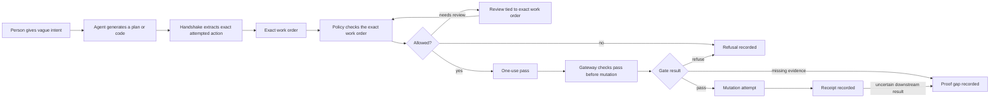

# Plain-English Protocol Guide

Last plain-language protocol audit: 2026-05-20.

This document translates `docs/internal/protocol-definition.md` and
`docs/internal/protocol-kernel-architecture.md` into plain language. If this
guide conflicts with the protocol definition, the protocol definition wins.

## The Simple Idea

Handshake exists because agents will do real work through tools.

Some of that work changes things that matter: packages, repos, deploys, cloud
settings, CI, databases, and other protected systems.

Handshake says:

> Before an agent changes a protected system, turn the attempted change into an
> exact work order, check that exact work order, make the real gate check the
> pass before anything changes, and keep a record of what happened.

## The Work Order

A vague request is not enough.

This is vague:

```text
Upgrade staging.
Fix the build.
Install the package.
Ship the preview.
```

Handshake forces the agent to produce the exact work order:

```text
action: x402_payment.exact
endpoint: https://api.example.test/report
payee: 0x1234...abcd
network: base-sepolia
token: USDC
amount: 2500 atomic units
expected side effect: wallet payment signature for one paid request
gateway: x402-wallet-gateway
```

That exact work order is the action contract.

## The Pass

If policy allows the exact work order, Handshake may issue a one-use pass.

The pass is not general permission. It is not:

- "the agent is trusted";
- "the tool is safe";
- "the whole plan is approved";
- "future retries are allowed";
- "nearby actions are allowed."

It means only:

> This one exact work order may be checked by this one gateway before this one
> mutation attempt.

## The Gate

The gateway is the part that can actually block the protected system from
changing.

For package install, the gateway controls the manifest edit.

For deploy, the gateway controls the deploy call.

For repo write, the gateway controls the write path.

For cloud config, the gateway controls the cloud mutation credential.

If the gateway cannot block the change, Handshake can observe or record, but it
cannot protect that path.

## The Record

After the check, Handshake records what happened:

- the work order;
- the policy decision;
- the one-use pass, if one was issued;
- the gateway check;
- whether mutation was attempted;
- whether downstream result is known;
- whether there was a refusal;
- whether evidence is missing or ambiguous.

That record is a receipt.

A receipt proves the Handshake chain. It does not prove the action was useful,
safe, profitable, or successful everywhere downstream.

## What This Repo Proves Today

This repo proves the local kernel mechanics: exact work orders, one-use passes,
gateway checks, refusals, proof gaps, idempotency duplicate handling, local D1
reconstruction, x402 payment runtime ingress, local payment gateway fixture
coverage, package-install regression binding, and representation shapes that
cannot create permission.

It does not prove a live hosted service, a real external payment provider gateway,
generic MCP/runtime control, x402 spend-window ledger enforcement, or independent
package-material verification. It does include local AuthorityCertificate
minting and offline pinned-key verification, but not cross-org trust, live key
revocation, hosted verify APIs, marketplace certification, or provider custody.

## The Whole Flow



## Gateway Policy In Plain English

Gateway policy is the rulebook for one protected gate.

It is set before the agent acts, by the owner of the protected system.

Self-hosted example:

```text
In this repo, the package-install gateway may edit only this manifest,
only through the package_install action shape,
only when package name, version, manifest path, package manager,
params digest, and idempotency key match the one-use pass.
```

Hosted example:

```text
An org admin sets the policy in Handshake Cloud.
Handshake Cloud versions and distributes the policy.
The gateway still checks it before mutation.
```

The agent can read the policy. The agent cannot define the policy for the
action it wants to perform.

## Deny Events

A denial is not noise. It is part of the protocol.

Examples:

- the agent's proposed action is too vague;
- the action is not in the action catalog;
- the resource is outside the allowed envelope;
- policy refuses;
- review rejects;
- the pass expired;
- the pass was already used;
- gateway parameters drifted;
- gateway policy changed incompatibly;
- isolation is active;
- downstream evidence is missing.

The right outcome is a refusal or proof gap, not a hidden retry.

## Conflict Resolution

Handshake resolves conflict by narrowing authority.

If two rules disagree, do not mutate.

If the gateway policy changed incompatibly, do not mutate.

If evidence is missing, say evidence is missing.

If recovery needs another action, create a new work order. Do not reuse the old
pass.

## Is It Two-Sided?

At the core event, no.

The event is one protected mutation attempt:

```text
one exact work order
one decision
one-use pass
one gateway check
one receipt, refusal, or proof gap
```

There are two boundaries:

- the agent/action boundary, where vague intent becomes an exact work order;
- the gateway boundary, where the protected system can actually block the
  mutation.

That does not make the core protocol a marketplace or negotiation protocol.

## Bilateral Ecosystem In Plain English

Bilateral ecosystem use can emerge when agents negotiate obligations for
different principals.

But each side still authorizes only its own protected surface.

Example:

```text
Agent A offers: deploy a preview.
Agent B offers: run an evaluation against the preview.
```

That should become:

```text
Agreement:
  A obligation -> A action contract -> A policy -> A gateway -> A receipt
  B obligation -> B action contract -> B policy -> B gateway -> B receipt
```

A cannot authorize B's system. B cannot authorize A's system.

The bilateral object is the agreement. The enforcement object is still each
side's own action contract and gateway check.

## Translation Table

| Plain phrase             | Protocol phrase                                 |
| ------------------------ | ----------------------------------------------- |
| The person asks for work | Principal intent                                |
| The agent makes a plan   | Runtime execution and generated execution graph |
| The proposed change      | Candidate action                                |
| The exact work order     | Action contract                                 |
| The rule check           | Policy decision                                 |
| The one-use pass         | Greenlight                                      |
| The real gate            | Gateway check                                   |
| The change attempt       | Mutation attempt                                |
| The record               | Receipt                                         |
| The no                   | Refusal                                         |
| The missing evidence     | Proof gap                                       |
| The emergency stop       | Isolation state                                 |
