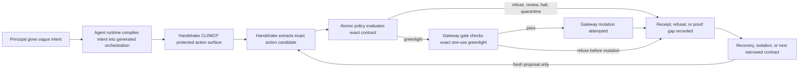
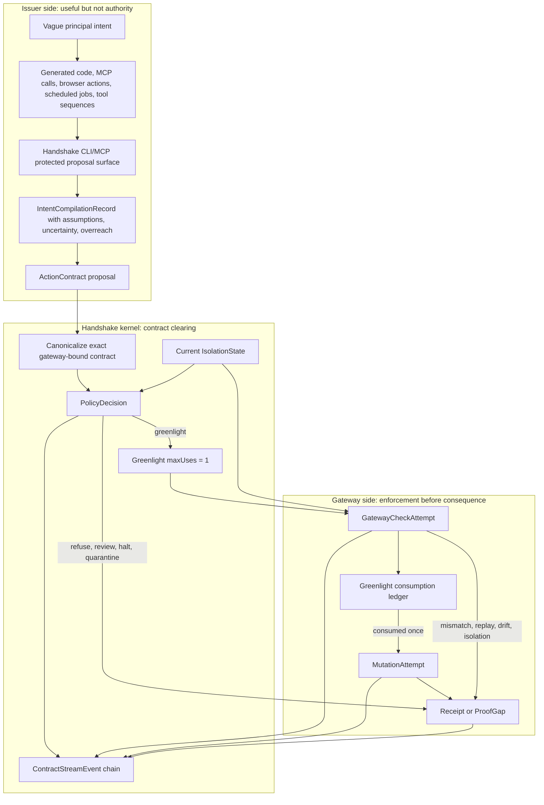
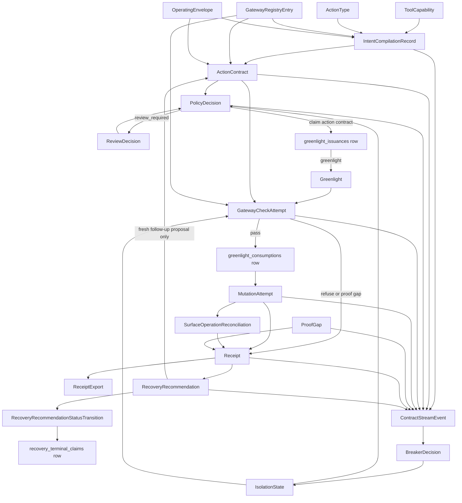
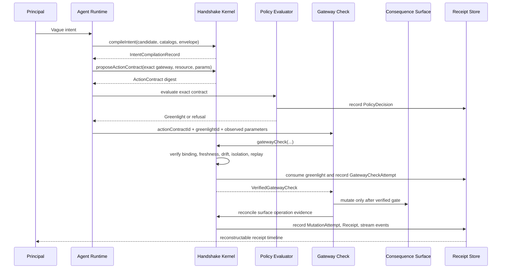
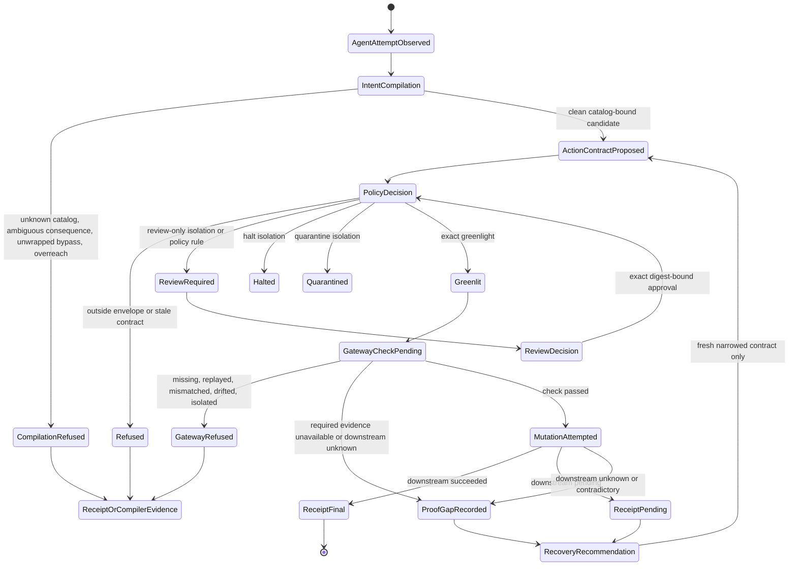
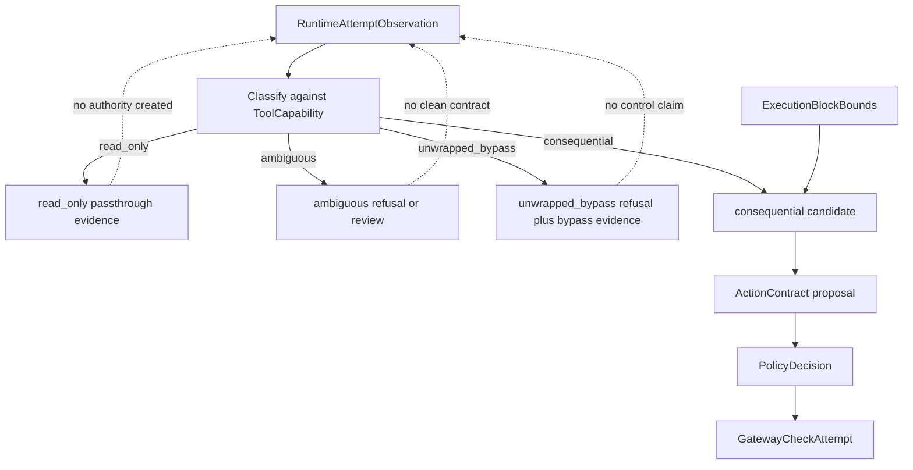

# Product And Protocol Diagrams

Status: Draft canonical visual model
Version: v0.2.1
Audience: Product, protocol implementers, runtime builders, gateway owners, platform engineering, security engineering
Implementation status: Drawn against the current v0.2 protocol kernel, runtime wrappers, gateway adapters, D1 records, and completion audit
Canonical owner: Product owner
Last reviewed: 2026-05-18

## Invariant At Stake

No consequential autonomous action executes outside declared bounds, and divergent behavior must be haltable, isolatable, and reconstructable.

These diagrams are not product promises. They are visual checks on the protocol boundary. If a path reaches gateway mutation without an exact action contract, policy decision, one-use greenlight, gateway check, and receipt or proof gap, that path is not Handshake.

## Product Loop

This is the customer-facing loop. It shows why Handshake exists without pretending the runtime or UI is the authority boundary.

Product reading:

- The operating envelope permits attempts, not mutation.
- The agent proposes. It does not authorize.
- CLI/MCP is the reusable product surface for protected proposals, setup, inspection, and conformance.
- Policy clears the exact contract, not a plan summary.
- The gateway check enforces before consequence.
- Evidence can be a success receipt, refusal, pending downstream status, or proof gap.

## Authority Boundary

This is the boundary that cannot move left into the runtime or review UI.

Forbidden reading:

- A runtime hook is not gateway enforcement.
- The CLI/MCP surface is not gateway enforcement.
- A generated plan is not an action contract.
- A review screen is not authority unless bound to the exact contract and policy digest.
- A greenlight cannot authorize more than one gateway-checked attempt.

## Protocol Object Graph

This is the durable object graph the current v0.2 kernel persists or derives from durable ledgers.

Protocol reading:

- Catalog objects bind the compiler before a contract exists.
- `ActionContract` is a proposed commitment, not execution authority.
- `Greenlight` is exact, gateway-bound, and one-use; issuance is claimed once per action contract before the record is committed.
- `ProofGap` is a first-class object, not receipt prose or mutation authority.
- Recovery creates a narrowed future proposal path. It does not reuse a greenlight or mutate a gateway.

## Gateway-Gated Mutation Sequence

This is the normal successful path with the exact enforcement point shown.

If the gateway mutates before `VerifiedGatewayCheck`, this is advisory, not Handshake.

## Refusal And Proof-Gap Paths

These paths must stay visible in the product. They are not edge-case errors; they are protocol outcomes.

## Runtime Conformance Direction For 02

This diagram is where `02-plan-eng-review-agent-requirements.md` should go next: a conformance model for generated orchestration, not a second authority model.

02 should add issuer-side conformance evidence, not weaken gateway-side enforcement.

## Brutal Verdict

Keep these diagrams narrow. The product diagram is allowed to be simple, but the protocol diagrams must remain unforgiving: every consequential mutation path either reaches gateway-checked authority or records refusal, proof gap, bypass evidence, or isolation.

Smallest next mechanism: turn the runtime conformance direction into concrete `ExecutionBlockBounds` and `RuntimeAttemptObservation` schemas before adding another runtime integration.
