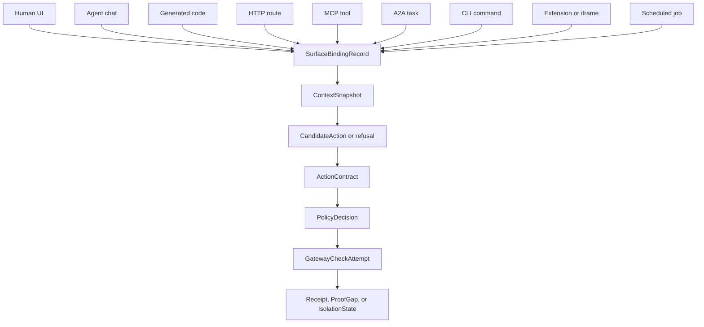

# Agent-Native Surface Binding

Status: Product architecture concept
Version: v0.2.1
Audience: Product, protocol implementers, runtime builders, gateway owners, security engineering
Implementation status: Concept and planning constraint; not yet implemented as a protocol object
Canonical owner: Product owner
Extends: [`full-agentic-experience-architecture.md`](./full-agentic-experience-architecture.md), [`cli-mcp-surface.md`](./cli-mcp-surface.md), [`../specs/00-product-requirements-spine.md`](../specs/00-product-requirements-spine.md), [`../plans/README.md`](../plans/README.md)
External research inputs: [Agent-Native What Is Agent Native](https://www.agent-native.com/docs/what-is-agent-native), [Agent-Native Key Concepts](https://www.agent-native.com/docs/key-concepts), [Agent-Native Actions](https://www.agent-native.com/docs/actions), [Agent-Native A2A Protocol](https://www.agent-native.com/docs/a2a-protocol), [BuilderIO agent-native repo](https://github.com/BuilderIO/agent-native)
Last reviewed: 2026-05-18

## Invariant At Stake

Agent-native surfaces must not turn shared application state into shared mutation authority.

The invariant is:

```text
Every surface that can initiate the same consequential mutation must bind to
the same exact ActionContract boundary before authority exists.
```

If the UI can do it, the agent can do it, the CLI can do it, an MCP tool can do
it, an A2A task can request it, and an extension can trigger it, then Handshake
must not ask "which surface is trusted?" first.

Handshake must ask:

```text
Which exact protected action is being attempted, which surface originated it,
which caller and runtime are bound to it, which context snapshot informed it,
which gateway owns consequence, and where is the one-use greenlight checked?
```

Without this, agent-native design becomes ambient authority with better UX.

## Definition

For Handshake, **agent-native** does not mean "the app has a chat box" or "the
agent can use the same database as the UI."

Agent-native means:

```text
Multiple live surfaces can originate, inspect, continue, or render the same
application work over shared state.
```

Those surfaces include:

- human UI;
- agent chat;
- generated code;
- HTTP routes;
- MCP tools;
- A2A tasks;
- CLI commands;
- browser-side tools;
- extensions and iframe mini-apps;
- scheduled jobs and continuations;
- background workers;
- replay, eval, or simulation runners.

The Handshake primitive is **Agent-Native Surface Binding**:

```text
origin surface + caller/runtime identity + context snapshot + action catalog
  -> CandidateAction or refusal
  -> exact ActionContract
  -> policy decision
  -> one-use greenlight or refusal
  -> gateway check before mutation
  -> receipt, proof gap, quarantine, or recovery state
```

Surface parity is callability parity, not authority parity.

## External Pattern

The Agent-Native project is useful because it makes the modern pattern explicit:
agent and UI are peers over the same application model.

The core pattern is:

- data lives in shared SQL-backed state;
- actions are exposed as reusable callable operations;
- the agent knows current app context such as current screen, selected object,
  selected text, or active workspace;
- UI and agent state synchronize in near real time;
- workspaces carry memory, instructions, skills, MCP servers, secrets, and
  sub-agents;
- remote agents can call other agents through A2A-style task handoff;
- extensions can be created and run as sandboxed mini-apps inside the host app;
- a connected provider or credential can be reused across apps through workspace
  grants.

That is a good app architecture pattern. It is not an authority model.

The repo's own QA notes are the warning label:

- request-scoped globals can leak caller identity across concurrent users;
- process-level environment mutation can cause wrong-user writes;
- concurrent tool calls can corrupt shared stdout or console monkey patches;
- A2A identity must come from verified fields, not convenient metadata;
- MCP servers can become SSRF bridges without network egress controls;
- iframe extensions that execute as the viewer cannot safely be public;
- replay, cron, stuck-job, upload, webhook, and SVG paths become security
  surfaces, not feature details.

The lesson is not "Agent-Native is unsafe." The lesson is sharper:

```text
Once UI, agents, extensions, remotes, and jobs share app state, every surface
becomes a possible authority laundering path.
```

## Handshake Translation

Agent-Native optimizes for building apps where UI and agents cooperate over one
state model.

Handshake optimizes for preventing any of those cooperating surfaces from causing
uncontracted consequence.

| Agent-native pattern | Handshake obligation |
|---|---|
| UI and agent can call the same action | The action must reduce to the same `ActionContract` regardless of origin. |
| Shared SQL/app state informs the agent | Context snapshot is evidence, not authority, and must be digest-bound when it affects a contract. |
| Actions are exposed as tools | Tool availability is not tool authorization; consequential tools must be narrower action-catalog entries. |
| Current screen/selection matters | UI state must be captured with freshness, actor, surface, and stale-state refusal rules. |
| Extensions run inside the app | Extension callability must be explicit; viewer credentials cannot become ambient mutation authority. |
| Workspace secrets and provider grants are reusable | Secret onboarding, grant scope, credential holder, and key minting are protected actions. |
| A2A lets agents call agents | Remote caller identity, task lifecycle, cancellation, replay, and result custody need receipts. |
| Memory and skills persist future context | Memory is provenance. It cannot silently change policy, envelope, or gateway authority. |
| Agents can improve app code | Generated artifact promotion is a protected action, not a direct file or deploy mutation. |
| Replays and evals simulate work | Simulation receipts must not be accepted as production gateway evidence. |

## Surface Binding Graph



The graph is intentionally surface-plural and authority-singular.

Every origin may have different ergonomics. None may bypass the contract and
gateway check if the action is consequential.

## Binding Record Shape

This is not yet a committed protocol schema. It is the shape future plans must
force into a real schema before claiming agent-native support.

```text
SurfaceBindingRecord
  binding_id
  origin_surface
  origin_surface_instance
  caller_identity_ref
  principal_scope_ref
  runtime_identity_ref
  operating_envelope_ref
  action_catalog_ref
  tool_catalog_ref
  gateway_registry_ref
  action_name
  requested_resource_ref
  params_digest
  context_snapshot_ref
  generated_artifact_ref
  continuation_ref
  remote_task_ref
  callability_posture
  credential_posture
  bypass_posture
  policy_context_ref
  created_at
```

Required postures:

| Posture | Meaning |
|---|---|
| `protected` | The path can reach mutation only through a gateway check. |
| `proposal_only` | The path can propose a candidate but cannot mutate. |
| `review_only` | The path can render or inspect but cannot propose or mutate. |
| `raw_bypass_possible` | A sibling path can mutate without Handshake. This is advisory unless blocked elsewhere. |
| `untrusted_surface` | The surface can run user or agent-generated behavior and needs explicit callability limits. |
| `remote_unverified` | A remote caller/task/result is not bound strongly enough to affect authority. |
| `simulation_only` | Evidence can support eval or replay, not production mutation proof. |
| `proof_gapped` | Handshake cannot prove enough to claim control. |

## Decision Graph

Agent-native support is not one decision. It is a chain of authority decisions.

```text
D4 developer entry surface
  -> S1 surface fan-out binding
  -> S2 untrusted app-surface callability
  -> S3 context/app-state snapshot binding

H1 hosted caller identity
  -> R1 remote principal/agent/runtime identity binding
  -> R2 remote task lifecycle and isolation
  -> R3 remote result and replay receipt semantics

D6 receipt reconstruction
  -> M1 memory/skill/instruction provenance
  -> V1 replay/eval/simulation boundary

D3 gateway credential posture
  -> K1 secret onboarding and key minting
  -> B1 budget/quota/resource consequence
  -> G1 generated artifact promotion
  -> C1 concurrency and serialization semantics
```

The decision that matters most:

```text
S1: Can the same logical protected action originate from multiple surfaces and
still reduce to one exact contract boundary?
```

If S1 is missing, every later surface adds a new bypass route.

## Failure Modes

### Same Action, Different Authority

The UI calls `deployPreview` directly, while the agent calls
`handshake.deploy.propose_preview`.

Failure: the generated code escaped the contract boundary.

Mechanism required: all consequential origins invoke the same action-catalog
entry or receive a structured refusal.

### Review State Differs From Contract State

The UI renders a clean summary from current app state, but the contract was
generated from stale selected text or a prior project.

Failure: this is review theatre.

Mechanism required: context snapshot digest, freshness window, selected object
binding, and stale-state refusal.

### Extension Spends Viewer Authority

An iframe extension uses host helpers to call an action with the viewer's
workspace grants.

Failure: extension code laundered viewer authority through a trusted host.

Mechanism required: extension-specific callability posture, allowed action list,
credential posture, and receipt-bound surface origin.

### Remote Agent Smuggles Scope

An A2A task returns a result that implies authority to continue a protected
operation.

Failure: remote delegation became ambient permission.

Mechanism required: remote principal, agent, runtime, task, cancellation, result,
and replay receipts. Remote result is evidence only until contracted locally.

### Memory Mutates Policy

An agent stores "this repo is safe to auto-deploy" as future memory, and later
policy treats it as trusted context.

Failure: memory became hidden policy.

Mechanism required: memory provenance, policy-input allowlist, versioned policy
context, and refusal when untrusted memory affects authority.

### Replay Becomes Proof

An eval replay produces a realistic receipt shape, then a downstream system
treats it as production gateway evidence.

Failure: this is evidence theatre.

Mechanism required: simulation boundary, environment class, gateway evidence
class, and receipt non-interchangeability.

### Continuation Mints Fresh Authority

A scheduled job resumes an old task and requests a new mutation without the
original caller, envelope, or freshness constraints.

Failure: the continuation overreached the principal.

Mechanism required: continuation refs, expiry, envelope revalidation, isolation
check, and no reuse of consumed greenlights.

### Concurrent Calls Cross Wires

Two tool calls run concurrently and share request-scoped mutable state.

Failure: caller identity, params, or receipts can bind to the wrong action.

Mechanism required: per-operation immutable context, no process-global caller
state, serialization rules per resource, and idempotency keys.

### Generated Artifact Promotes Itself

The agent writes code, updates a workflow, installs a package, and deploys a
preview from inside the generated program.

Failure: generated code moved from proposal into consequence without a gate.

Mechanism required: artifact custody, generated execution graph coverage,
protected promotion contract, gateway check, and downstream proof-gap handling.

## Plan-Eng Review

### What Already Exists

- The product requirements spine already requires plans to start from generated
  execution shape and protected action path.
- The full agentic experience architecture already states that every surface
  must bind to protocol objects and gateway-side enforcement.
- The CLI/MCP surface doc already treats proposal as distinct from mutation.
- The plans README now names the missing macro decisions: S1/S2/S3, R1/R2/R3,
  M1/V1, and K1/B1/G1/C1.

### What Is Missing

- No protocol object currently records origin surface, caller/runtime/context,
  callability, credential posture, and bypass posture as one binding record.
- No acceptance test currently proves that UI, MCP, CLI, HTTP, and extension
  origins reduce to the same canonical contract for the same protected action.
- No stale context rule exists for selected UI state, active resource, generated
  artifact, remote result, or continuation.
- No extension or remote-agent callability model exists.
- No formal boundary prevents memory, replay, or eval evidence from being used
  as authority inputs.

### Not In Scope

- A general-purpose agent app framework.
- A replacement for Agent-Native, MCP, A2A, Claude Code, Codex, LangChain, or
  browser-side tools.
- A claim that Handshake controls every surface in an organization.
- Public extension marketplaces.
- Cross-org agent federation.
- Provider integration breadth.
- A dashboard-first product surface.

### Acceptance Evidence For Future Plans

Any future plan that claims agent-native support must include these checks:

- Same protected action through at least two origins produces the same canonical
  contract digest, or the plan explains why caller scope changes the digest.
- Missing or stale context snapshot refuses before candidate proposal or before
  policy decision, depending on where the uncertainty is detected.
- Extension-originated protected actions require explicit callability posture and
  cannot spend viewer credentials by default.
- Remote-agent results are evidence only until locally contracted.
- Memory, skill, and instruction records can be cited as provenance, but not used
  as policy authority unless allowlisted and versioned.
- Replay/eval/simulation receipts cannot satisfy production gateway evidence.
- Concurrent calls cannot share mutable request identity, params, or receipt
  writers.
- Secret, budget, generated artifact, and continuation actions are modeled as
  protected consequences, not setup details.

### Brutal Verdict

Keep the agent-native concept.

Cut agent-native as a product claim unless Handshake can show same-action,
multi-surface binding to the exact contract boundary.

Narrow the next implementation target to one golden protected action, two
origins, one shared binding record, one stale-context refusal, and one gateway
check.

## Product Claim Boundary

Allowed claim after S1 exists:

```text
Handshake can bind the same protected action across multiple agent-native
surfaces to one exact contract boundary before gateway-checked mutation.
```

Not allowed:

```text
Handshake secures agent-native apps.
Handshake controls every UI, agent, extension, MCP, A2A, and job path.
Handshake makes shared app state safe.
Handshake turns review screens into permission.
```

If a surface can still mutate the protected resource directly, the honest state
is bypass-risk or proof-gapped.

## Smallest Next Mechanism

Implement `SurfaceBindingRecord` as a planning-level schema and hostile fixture
for one protected action through two origins:

```text
MCP proposal origin + CLI proposal origin
  -> same canonical ActionContract digest
  -> stale context refusal fixture
  -> gateway check still owns mutation
```

Do not add more surfaces until that red test exists.
